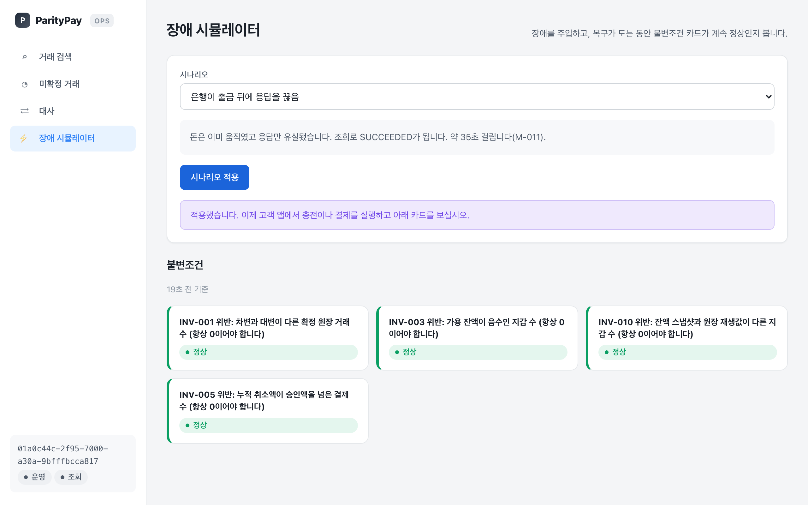
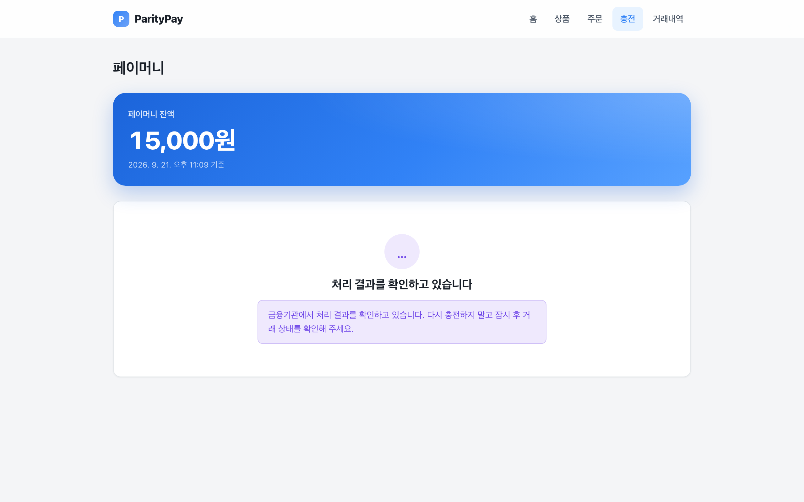
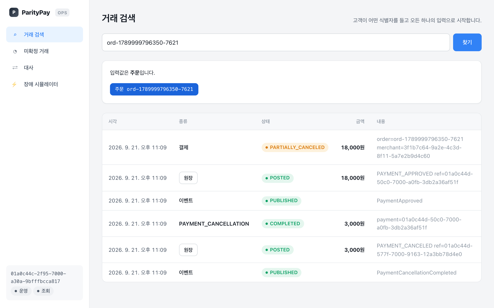
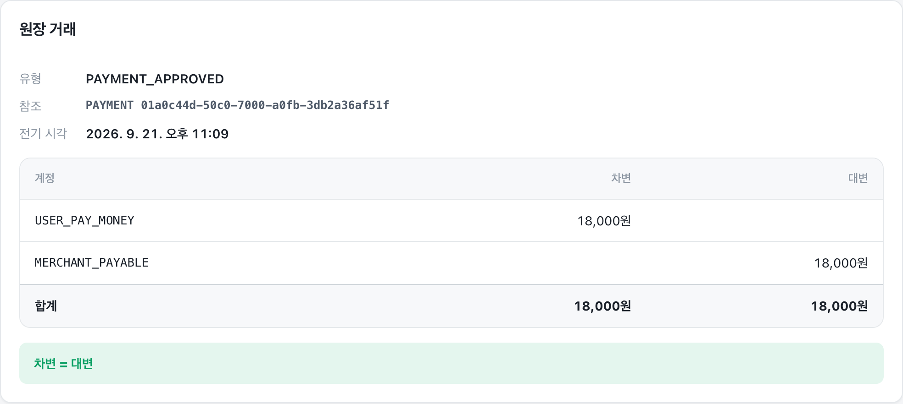
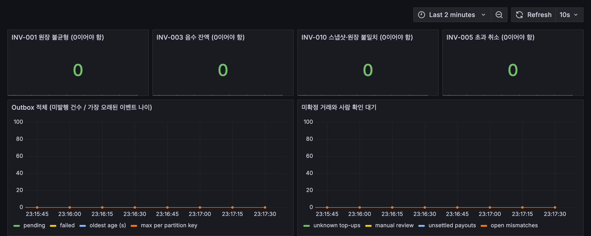
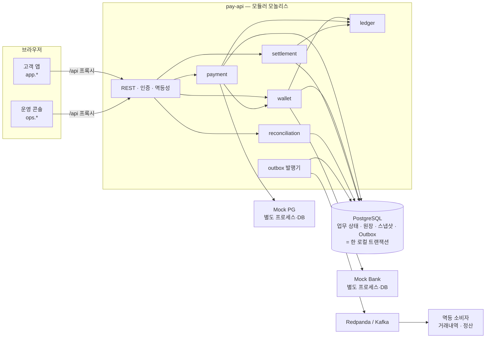

# ParityPay

> 장애가 나도 돈의 기록이 틀리지 않는 결제·원장 시스템 — 그리고 그것을 실제로 죽이고 재 본 기록

ParityPay는 플랫폼 안에 내장되는 **페이머니 서비스**(충전·결제·취소·판매자 정산·대사)를 처음부터 끝까지 구현한
포트폴리오 프로젝트입니다. 백엔드(Java 21 · Spring Boot 4 · PostgreSQL)와 고객 앱·운영 콘솔(React · TypeScript),
그 전부를 한 번에 띄우는 배포 형태가 한 저장소에 있습니다.

이 프로젝트가 답하려는 질문은 "정상 결제가 되는가"가 아닙니다.

> **중복 요청, 동시 잔액 차감, 외부 승인 후 응답 유실, 이벤트 중복 전달, 프로세스 재시작 — 이런 일이 실제로
> 일어난 뒤에도 돈의 기록이 정확한가?**

그 질문에 문서가 아니라 **실행으로** 답했습니다. 자동화 테스트 391건(백엔드 328 · 프론트엔드 56 · E2E 7)이
매 커밋마다 돌고, 부하·장애 실험 41종이 프로세스를 죽이고, 브로커를 죽이고, 외부기관을 멈추고, 락 서버를
뺏어 가면서 결함 14건을 찾아냈으며 전부 고쳤습니다. 수치는 전부 실측값이고, 재지 못한 것은 재지 못했다고
적혀 있습니다.

---

## 5분 안에 보기

처음 오셨거나 시간이 많지 않다면 이 순서로 보시면 됩니다.

| 순서 | 무엇을 | 어디서 | 왜 |
|---|---|---|---|
| 1 | 결과 한 장 | 바로 아래 [실험이 보여 준 것](#실험이-보여-준-것) | 이 프로젝트가 무엇을 증명했는지 숫자로 |
| 2 | 설계와 판단의 이유 | [포트폴리오 기술 보고서](reports/12-portfolio-technical-report.md) | 문제 정의 → 구조 → 검증 → 회고, 한 문서 |
| 3 | 실험 원본 | [성능·장애 보고서](reports/11-performance-failure-report.md) | 41종의 방법·표·분석·원본 경로. 틀렸던 가설도 그대로 |
| 4 | 왜 이렇게 결정했나 | [ADR 14편](docs/adr/README.md) | 각 결정의 대안·근거·실험 결과(Outcome) |
| 5 | 직접 띄워 보기 | `scripts/dev.sh` → [실행·데모 안내서](docs/21-quickstart-and-demo.md) | 운영 콘솔의 장애 시뮬레이터에서 직접 깨뜨려 볼 수 있습니다 |

코드를 먼저 보시겠다면: 잔액을 움직이는 단일 UPDATE는
[`WalletPersistenceAdapter`](modules/wallet/src/main/java/io/parity/pay/wallet/adapter/out/persistence/WalletPersistenceAdapter.java),
결제 트랜잭션 경계는
[`PaymentTransactions`](modules/payment/src/main/java/io/parity/pay/payment/application/service/PaymentTransactions.java),
외부 응답 유실을 `UNKNOWN`으로 보존하는 곳은
[`PaymentService`](modules/payment/src/main/java/io/parity/pay/payment/application/service/PaymentService.java)입니다.

## 실험이 보여 준 것

같은 코드를 실제로 띄우고 부하를 주고 죽여서 잰 결과 중 대표적인 것들입니다. 전부
[reports/11](reports/11-performance-failure-report.md)에 방법·표·원본이 있습니다.

| 무엇을 했나 | 결과 | 근거 |
|---|---|---|
| 충전 요청이 흐르는 중에 프로세스를 `SIGKILL` (3회) | 응답 못 받은 13~14건을 같은 멱등 키로 재요청 → 중복 0, 유실 0. 커밋 전 종료와 커밋 후 응답 전 종료를 DB가 구분 | F-001·F-002 |
| Outbox 발행 중 브로커를 `docker kill` | `acks=all`(기본)은 "PUBLISHED인데 브로커에 없음" 0건 × 3회. `acks=1`·`0`으로 낮추면 99~200건 유실 | M-016 |
| 파티션 키를 Aggregate ID 대신 랜덤으로 | 결제의 32~33%가 취소보다 늦게 도착해 판매자에게 건당 3,600원 과지급. Aggregate ID면 0건 | M-017 |
| 발행기를 JVM 4대로 | 순서 역전 50/20,000건 → 결함 F 수정 후 0건, 처리량 4,878/s | M-001 |
| 외부 PG가 30초 동안 응답을 붙잡을 때 | 플랫폼 스레드는 24초 만에 잔액 조회까지 전부 멈춤. 벌크헤드 50 + 차단기를 넣자 조회 p95 10 ms, 차단기가 열린 동안 결제 329~360건은 기관에 닿지 않고 즉시 `FAILED` | M-019~M-023, 결함 N |
| 잔액 차감을 분산락(SETNX+TTL)으로 감싸고 락 lease가 트랜잭션보다 먼저 만료되게 | 지갑당 60건만 승인 가능한데 141~149건 승인, 원장 −81,000~−89,000원. Watchdog은 프로세스 정지(`SIGSTOP`) 앞에서 무력, fencing token은 안전하되 요청의 99%를 거부. **같은 조건의 조건부 원자 UPDATE(본 설계)는 정확히 240건 승인, 오차 0, 처리량 2~4배** | M-024~M-028, ADR-004 |
| 동일 지갑에 20 VU를 몰아 잠금 대기를 DB 안쪽에서 측정 | 대기 표본의 84%가 잔액 행 잠금. 차감을 트랜잭션 마지막으로 옮겨 처리량 1.75배 | M-007, 결함 I |
| Outbox 적체 22,572건 해소 | 건별 전송 80건/초 → 배치 전송 536.7건/초 | P-003·P-005 |

**결함 14건(A~N) 중 설계 검토로 문서나 코드를 읽어서 나온 것은 하나도 없습니다.** 여섯(B·C·F·J·K·L)은 "대비되어
있다"고 문서에 적혀 있던 것이었고, 하나(J)는 시험이 **있었는데도** 통과했습니다 — 그 시험이 증명할 수 있는 것보다
적게 주장하고 있었기 때문입니다. 목록은 [기술 안내서 §13](docs/18-technical-handbook.md#13-실험이-찾은-결함-an)에 있습니다.

## 무엇을 만들었나

| 영역 | 내용 |
|---|---|
| 지갑·충전 | 회원 가입 → 지갑 생성 → Mock Bank 계좌 연결 → 충전. 멱등성, 동시 요청, 외부 응답 유실 시 `UNKNOWN` 보존과 자동 복구 |
| 결제·취소 | 페이머니 결제와 외부 PG(카드) 결제, 전액·부분 취소, 동시 취소 초과 차단, 구매확정 |
| 이중부기 원장 | 모든 금융 변경을 차변=대변 분개로 기록. 확정 항목은 수정·삭제 불가(DB 트리거), 취소는 역분개, 오류는 보정 분개 |
| 정산 | 구매확정 → 정산 계산(수수료·취소·조정) → 판매자 지급. 지급 응답 유실 복구 |
| 대사 | 내부(원장 vs 스냅샷)·외부(기관 기록 vs 우리 기록) 대사, 6종 불일치 분류, 운영자 해결, 이중 승인 보정 |
| 이벤트 | Transactional Outbox 발행기(재시도·백오프·배치·DLT), 멱등 소비자, 거래내역 프로젝션 |
| 운영 | 통합 거래 타임라인, 미확정 거래 조회·재조회, 감사 로그, 불변조건 상시 지표와 경보 |
| 보안 | JWT + httpOnly 리프레시 쿠키, 역할 6종, 이중 승인, 로그인 잠금, 비밀번호 재설정 메일 |
| 화면 | 고객 앱(Shop · My Pay · 판매자 정산)과 운영 콘솔(거래 검색 · 원장 탐색기 · 대사 · 장애 시뮬레이터) |
| 외부기관 대역 | Mock Bank·Mock PG — 별도 프로세스, **자기 데이터베이스**, 장애 모드(지연·응답 유실·연결 거부) |

범위 밖: 송금·출금, 위험 규칙 엔진, 포인트. 정의만 있고 구현하지 않았습니다([기술 안내서 §16](docs/18-technical-handbook.md#16-알려진-한계와-미측정)).

## 화면으로 보기

운영 콘솔의 **장애 시뮬레이터**에서 "은행이 출금 뒤에 응답을 끊음"을 적용한 상태입니다. 아래 불변조건 카드는 장애가
걸려 있고 미확정 거래가 복구되는 동안에도 전부 정상입니다.



그 상태에서 고객이 충전하면 **실패가 아니라 "확인 중"**입니다. 돈은 이미 은행에서 나갔고 응답만 유실됐으므로, 실패라고
말하면 고객은 다시 충전하고 이중 출금이 됩니다. 이 화면은 빨강을 쓰지 않고 다시 시도하는 버튼도 없습니다
([ADR-012](docs/adr/012-frontend-design-system.md)). 약 35초 뒤 복구 작업이 은행에 조회해 "충전 완료"로 바뀝니다.



운영자는 고객이 들고 오는 식별자 하나(주문번호)로 결제 → 원장 분개 → 이벤트 → 부분 취소 → 역분개 → 이벤트를 한
타임라인에서 봅니다. 원장 줄을 열면 분개가 차변=대변인지 그 자리에서 확인합니다.





같은 지표가 Grafana에도 있습니다. 불변조건 네 개는 임계치가 0이고, Outbox 적체와 미확정 거래 수가 그 옆에 있습니다.



캡처는 2026-09-21, `scripts/dev.sh up --observability`로 띄운 로컬 스택에서 찍었습니다. 화면이 바뀌면 캡처도 낡습니다 —
파일명의 날짜가 그 기준입니다.

## 어떻게 지키나 — 불변조건과 강제 수단

시스템이 지켜야 하는 규칙 10개를 먼저 정하고([CLAUDE.md §2](CLAUDE.md)), 각각을 **애플리케이션 코드가 아닌 곳**에서도
막도록 했습니다. 애플리케이션 버그나 운영자의 SQL로도 깨지지 않게 하기 위해서입니다.

| 불변조건 | 강제 수단 | 상시 감시 |
|---|---|---|
| INV-001 확정 원장 거래의 차변 합계 = 대변 합계 | DB 지연 제약 트리거 — 불균형 분개는 커밋 시점에 거부 | `paritypay_invariant_unbalanced_ledger_transactions` |
| INV-003 가용 잔액 ≥ 0 | 조건부 원자 UPDATE(`WHERE available >= amount`) + DB CHECK | `paritypay_invariant_negative_wallet_balances` |
| INV-004 같은 업무 참조의 금융 효과는 정확히 1회 | 멱등 키(`principal + operation + key`) + 원장 유니크 제약(두 번째 방어선) | — |
| INV-005 취소 완료액 + 처리중 취소액 ≤ 승인액 | 요청 시점 예약을 조건부 UPDATE로 + DB CHECK | `paritypay_invariant_over_cancelled_payments` |
| INV-006 확정 원장 항목 UPDATE·DELETE 금지 | DB 트리거 | — |
| INV-010 잔액 스냅샷 = 원장 계산값 | 같은 트랜잭션에 기록, 검증 API, 재구축은 원장에서만·이중 승인 | `paritypay_invariant_balance_snapshot_drift` |

지표는 평소에 전부 0이어야 하고, 0이 아니면 시스템이 스스로 규칙을 어긴 것이므로 **한 건이라도 즉시 경보**합니다.
부하 실험에서 결제 21,930건을 만든 뒤에도 전부 0이었습니다.

## 아키텍처



네 가지 결정이 나머지를 정합니다.

1. **원장이 진실이고 잔액은 스냅샷입니다** ([ADR-002](docs/adr/002-postgresql-system-of-record.md)·[003](docs/adr/003-double-entry-ledger.md)·[008](docs/adr/008-ledger-balance-snapshot.md)).
   잔액을 SQL로 고치는 경로가 없습니다. 어긋나면 원장에서 다시 계산합니다.
2. **금융 변경·원장·스냅샷·이벤트 발행 의도를 한 로컬 트랜잭션에 씁니다** ([ADR-005](docs/adr/005-transactional-outbox.md)).
   "DB는 커밋됐는데 메시지는 안 나감"이 구조적으로 불가능합니다. 발행은 별도 발행기가 at-least-once로 합니다.
3. **브로커의 at-least-once는 멱등 소비자가 흡수합니다** ([ADR-006](docs/adr/006-at-least-once-idempotent-consumer.md)).
   같은 이벤트가 두 번 와도 금액은 한 번만 움직입니다. 파티션 키는 Aggregate ID라 한 지갑의 순서가 지켜집니다.
4. **외부 결과를 모르면 `UNKNOWN`으로 보존하고 조회로만 확정합니다** ([ADR-007](docs/adr/007-unknown-state.md)).
   타임아웃을 실패로 단정하지 않고, 멱등성 없는 재시도를 하지 않습니다. 복구 작업이 백오프하며 묻고, 안전하지 않으면 사람에게 넘깁니다.

그 위에 외부 호출은 DB 트랜잭션 밖에서 하고 벌크헤드·차단기로 격리하며([ADR-014](docs/adr/014-external-call-isolation.md)),
분산락은 쓰지 않습니다 — 왜 쓰지 않는지를 실제로 만들어 재 봤습니다([ADR-004](docs/adr/004-atomic-balance-update.md)).
배포는 두 앱이 각자 자기 오리진에서 `/api`를 프록시하는 형태라 교차 오리진 요청이 없고 CORS 설정도 없습니다
([ADR-011](docs/adr/011-deployment-shape.md)).

## 검증

**자동화 테스트** — 백엔드 328 · 프론트엔드 56 · E2E 7, 실패 0 (2026-09-17). 통합 테스트는 Testcontainers로 실제
PostgreSQL·Redpanda를 띄우고, 외부기관도 별도 Spring 컨텍스트로 실제로 띄웁니다. 인메모리 DB나 목 기관은 쓰지 않습니다 —
타임아웃은 진짜 읽기 타임아웃이어야 하기 때문입니다. 테스트 이름은 요구사항 ID(`INV-`, `FR-`, `F-`)를 달고 있고,
[CI](.github/workflows/ci.yml)가 불변조건 추적·문서 링크·비밀값·생성 타입 드리프트까지 검사합니다.

**부하·장애 실험 41종** — 모두 [실험 실행 안내서](docs/19-experiment-runbook.md)의 명령으로 재실행할 수 있습니다.

| 종류 | 실험 | 무엇을 봤나 |
|---|---|---|
| 성능 기준선 | P-001~P-005 | 서로 다른/같은 지갑 처리량, Outbox 적체 해소, 정산 배치와 API 혼합 |
| 장애 시나리오 | F-001~F-011 | 커밋 전/후 종료, 발행 전 종료, ACK 유실, 승인 후 응답 유실, 중복·역순 웹훅, 조회 장애, 지급 응답 유실, 기관 명세 결측 |
| 측정·규명 | M-001~M-014 | 다중 인스턴스 순서, 재분배 중복, 원장 집계 비용, 잠금 대기 원인, 깊은 페이지, 미확정 적체, 단일 DB 한계, 시뮬레이터 시나리오 매트릭스 |
| Kafka 전달 보장 | M-015~M-018 | 커밋 방식, `acks`, 파티션 키, poison message |
| 외부기관 격리 | M-019~M-023 | 타임아웃 없음, 재시도 증폭, 차단기 전이, 리미터 알고리즘, 벌크헤드 |
| 분산락 대조 | M-024~M-028 | lease 만료, Watchdog, fencing token, 조건부 UPDATE 대조군, 락 서버 단절 |

**운영 콘솔의 장애 시뮬레이터** 9개 시나리오는 브라우저에서 직접 적용해 볼 수 있고, 실측은
[reports/13](reports/13-failure-scenario-matrix.md)에 있습니다.

## 기술 스택

| 층 | 선택 | 비고 |
|---|---|---|
| 언어·런타임 | Java 21 (가상 스레드) | 외부 호출이 스레드를 붙잡아도 무관한 API가 살아남는지 M-019에서 실측 |
| 프레임워크 | Spring Boot 4.1 · Spring Data JPA + JDBC · Spring Kafka · Spring Security (JWT) | 잔액 UPDATE 같은 핵심 문장은 JDBC로 직접 |
| 데이터 | PostgreSQL 17 · Flyway 마이그레이션 21개 | 불변조건을 CHECK·트리거·지연 제약으로 DB에 내림 |
| 메시징 | Redpanda (Kafka 호환) · Transactional Outbox · DLT | `acks=all` + 멱등 프로듀서 |
| 격리 | Resilience4j (차단기·벌크헤드·리미터) | Spring 통합 없이 라이브러리만 |
| 프론트엔드 | React 19 · TypeScript 5.9 · Vite · 순수 CSS 토큰 패키지 | 생성된 API 타입, 멱등 키·폴링 계약을 클라이언트 라이브러리가 강제 |
| 테스트 | JUnit 5 · Testcontainers · ArchUnit · Vitest · Playwright | 모듈 의존 규칙과 "금액에 float 금지"를 ArchUnit이 검사 |
| 품질 | Spotless(palantir) · Error Prone · GitHub Actions | 린트 위반은 경고가 아니라 빌드 실패 |
| 관측 | Micrometer · Prometheus · Grafana · OpenTelemetry · Jaeger | 불변조건 지표는 임계치 0 |
| 실험 | k6 스크립트 · 파이썬 하니스 (load-tests/ 23개) | 프로세스 `SIGKILL`/`SIGSTOP`, 컨테이너 `kill`, 기관 장애 모드 |

## 저장소 구조

```text
modules/shared-kernel   Money, 타입 ID, 오류 코드, 멱등성·이벤트 포트 (순수 자바)
modules/ledger          이중부기 원장: 도메인·전기 서비스·조회 API·JPA 어댑터
modules/wallet          지갑·잔액 스냅샷·충전·복구·거래내역 프로젝션
modules/payment         결제·취소·구매확정
modules/settlement      정산 계산·판매자 지급·지급 복구
modules/reconciliation  내부·외부 대사와 보정
apps/pay-api            조립 지점: 마이그레이션, 인증, Outbox, 운영 API, 실험 프로필
apps/mock-bank          외부 은행 대역 — 별도 프로세스, 자기 데이터베이스
apps/mock-pg            카드 PG 대역 — 별도 프로세스, 자기 데이터베이스
apps/web-customer       고객 앱 (Shop · My Pay · 판매자 정산)
apps/web-ops            운영 콘솔 (거래 검색 · 원장 · 대사 · 장애 시뮬레이터)
apps/e2e                Playwright — 목 없이 실제 스택을 도는 유일한 시험
packages/api-client     생성된 API 타입 + 멱등 키·토큰·폴링 계약
packages/ui             두 앱이 공유하는 CSS 토큰·프리미티브
load-tests/             k6 스크립트와 실험 하니스 — 41종의 실행·측정
deploy/                 배포 형태(두 오리진, TLS, 관측성 스택)
docs/                   설계 문서 20편, ADR 14편, 생성된 OpenAPI
reports/                실험 보고서 3편과 원본 결과(reports/data)
```

각 모듈은 `domain / application / adapter` 계층이고, 모듈 간에는 공개 포트와 이벤트만 씁니다. `ledger`는 다른 업무
모듈을 모릅니다. 이 규칙은 ArchUnit이 매 빌드에서 검사합니다.

## 실행 방법

필요한 것: JDK 21, Docker. 화면까지 보려면 Node 20+와 pnpm.

```bash
export JAVA_HOME=$(/usr/libexec/java_home -v 21)
scripts/dev.sh            # 컨테이너 → 기관 대역 → pay-api → 두 앱. 잡힌 포트는 우회합니다
scripts/dev.sh down
```

뜨면 고객 앱 http://localhost:5173, 운영 콘솔 http://localhost:5174 (`ops-operator@paritypay.local` / `local-ops-password`).
운영 콘솔의 장애 시뮬레이터에서 시나리오를 걸고 고객 앱에서 결제하면, 미확정 거래가 복구되는 동안 불변조건 카드가 계속
정상인 것을 볼 수 있습니다.

```bash
./gradlew test            # 백엔드 전체 — docker compose 없이도 됩니다 (Testcontainers)
pnpm -r test              # 프론트엔드
load-tests/run-e2e.sh     # 실제 스택 E2E (약 1분)
```

손으로 한 단계씩 띄우는 순서, API로 충전·결제·취소를 한 바퀴 도는 curl, 응답 유실을 손으로 재현하고 복구를 지켜보는
방법, 관측성 스택은 [실행·데모 안내서](docs/21-quickstart-and-demo.md)에 있습니다.

## 문서 — 누가 무엇을 읽나

| 읽는 사람 | 경로 |
|---|---|
| 프로젝트를 평가하려는 분 | 이 README → [reports/12 포트폴리오 기술 보고서](reports/12-portfolio-technical-report.md) → [reports/11](reports/11-performance-failure-report.md)에서 관심 있는 실험 하나 → 관련 [ADR](docs/adr/README.md) |
| 코드를 읽으려는 분 | [도메인 용어](docs/17-domain-glossary.md) → [기술 안내서](docs/18-technical-handbook.md) → [기술 설계서](docs/05-technical-design.md) · [정합성·복구 설계서](docs/09-consistency-recovery.md) |
| 실험을 재현하려는 분 | [실행·데모 안내서](docs/21-quickstart-and-demo.md) → [실험 실행 안내서](docs/19-experiment-runbook.md) → [결과 해석 안내서](docs/20-experiment-result-interpretation.md) |
| AI 에이전트로 작업하려는 분 | [CLAUDE.md](CLAUDE.md) — 매 작업의 규칙과 어떤 문서를 언제 읽는지 |

전체 문서의 역할 분담과 "어느 문서가 어느 정보의 기준인가"는 [문서 지도](docs/00-document-map.md)에 있습니다.
설계 문서(DOC-01~16)는 구현 **전에** 쓰였고, 구현과 달라진 곳은 문서를 사실로 교체했습니다 — 이상적인 상태로
남겨 두지 않았습니다.

## 알려진 한계

- 성능 수치는 노트북 한 대에서 부하 도구·앱·DB가 CPU를 나눠 쓴 결과입니다. **절대 한계가 아니라 모양**이며, 같은
  환경의 상대 비교로만 씁니다([reports/11 §2](reports/11-performance-failure-report.md)).
- 단일 인스턴스·단일 DB입니다. 발행기·소비자의 다중 인스턴스는 실측했지만(M-001·M-002·M-005) API 인스턴스 여러 대와
  DB 이중화는 범위 밖입니다. 어디에서 먼저 막히는지는 M-013에 있습니다.
- 벌크헤드·차단기의 수치(50, 윈도 20, OPEN 10초)는 "상한이 있어야 한다"의 자리표시자이지 이 환경에서 최적화한 값이
  아닙니다([ADR-014](docs/adr/014-external-call-isolation.md)).
- E2E는 PR 게이트가 아니라 주간·수동 실행입니다. 실제 스택 전부와 브라우저가 필요해 무겁기 때문입니다.
- 송금·출금, 위험 규칙, 포인트, 화면 명도 대비(WCAG)는 구현·측정하지 않았습니다.

나머지는 [기술 안내서 §16](docs/18-technical-handbook.md#16-알려진-한계와-미측정)과 각 ADR의 Outcome에 "미측정"으로
적혀 있습니다.

<details>
<summary><strong>English summary</strong></summary>

ParityPay is a portfolio-scale, platform-embedded pay-money service — top-up, payment, cancellation, merchant
settlement and reconciliation — built as a Java 21 / Spring Boot 4 / PostgreSQL modular monolith with a React
customer app and an operations console in the same repository.

The question it answers is not "does a normal payment work" but **"is the money record still correct after duplicate
requests, concurrent debits, a lost response from an external institution, duplicate event delivery, or a process
restart?"** Ten financial invariants (balanced ledger, non-negative balance, exactly-once financial effect, immutable
posted entries, snapshot = ledger, …) are enforced in the database (CHECK constraints, deferred triggers, unique
constraints) as well as in code, and are watched by metrics whose alert threshold is zero.

Design in four decisions: the double-entry ledger is the system of record and the wallet balance is a snapshot;
business state, ledger, snapshot and outbox intent are written in **one local transaction**; the broker's
at-least-once delivery is absorbed by idempotent consumers; an unknown external outcome is preserved as `UNKNOWN`
and resolved only by inquiry, never by blind retry.

Evidence: 391 automated tests (328 backend with Testcontainers PostgreSQL/Redpanda and real institution stand-ins,
56 frontend, 7 Playwright E2E) and **41 load/failure experiments** that killed the process mid-transaction, killed
the broker mid-publish, hung the external PG for 30 s, and let a distributed-lock lease expire under load. They found
14 defects, all fixed; six of them were in areas the design documents had described as "already handled".
Every number in the reports is measured; anything unmeasured is marked as such.

Start with [reports/12](reports/12-portfolio-technical-report.md) (Korean), then
[reports/11](reports/11-performance-failure-report.md) for the experiment record and
[docs/adr](docs/adr/README.md) for the decisions. `scripts/dev.sh` brings the whole stack up locally.

</details>

## 라이선스

MIT. 자세한 것은 [LICENSE](LICENSE)에 있습니다.
