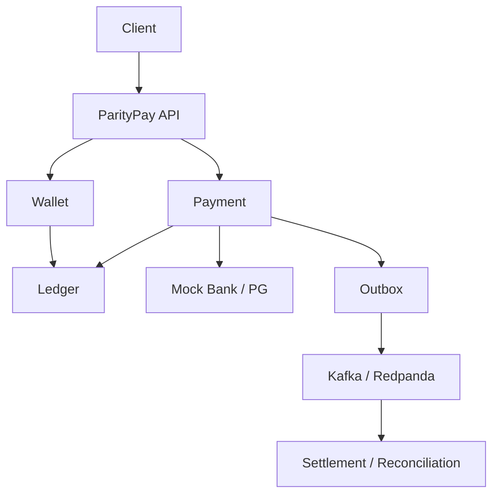

# ParityPay

> 장애가 발생해도 금융 불변조건을 지키는 결제·원장 백엔드 시스템

ParityPay는 플랫폼 내장형 페이머니 서비스를 구현하는 백엔드 포트폴리오 프로젝트입니다. 사용자는 Mock Bank 계좌에서 페이머니를 충전하고 주문을 결제하며, 결제 취소와 거래내역 조회를 수행합니다. 확장 단계에서는 부분 취소, 송금, 판매자 정산, 대사와 이상거래 탐지를 지원합니다.

이 프로젝트의 목표는 단순한 결제 API 연동이 아닙니다. 중복 요청, 동시 잔액 차감, 외부기관 승인 후 응답 유실, 이벤트 중복 전달과 프로세스 재시작 상황에서도 다음 불변조건을 유지하는 시스템을 구현하고 검증합니다.

- 모든 확정 원장 거래의 차변 합계와 대변 합계가 같습니다.
- 사용 가능 잔액은 음수가 되지 않습니다.
- 같은 업무 요청은 여러 번 도착해도 한 번만 금액에 영향을 줍니다.
- 누적 취소 완료액과 처리 중 금액은 승인액을 초과하지 않습니다.
- 확정 원장은 수정·삭제하지 않고 역분개 또는 보정 분개로 처리합니다.
- 결과가 불명확한 거래는 `UNKNOWN`으로 보존하고 최종 상태로 수렴시킵니다.

## 목표 아키텍처

구현은 Java 21, Spring Boot 4, PostgreSQL 기반 모듈러 모놀리스입니다. 결제·지갑·원장은 동일 DB 트랜잭션으로 핵심 불변조건을 보호하고, 후속 처리는 Transactional Outbox와 Kafka/Redpanda를 통해 비동기로 연결합니다.



## 구현 단계

1. 지갑·충전·이중부기 원장
2. 결제·전액 취소·멱등성·동시성 제어
3. Outbox·멱등 소비자·운영 조회
4. Mock PG 장애 시나리오·`UNKNOWN` 복구
5. 부분 취소·정산·대사
6. 관측성·부하 테스트·장애 테스트·포트폴리오 보고서

## 문서

AI 에이전트(Claude Code)로 이 저장소에서 작업한다면 [CLAUDE.md](CLAUDE.md)를 먼저 읽습니다. 전체 문서와 구현 시점은 [문서 지도](docs/00-document-map.md)에서 확인합니다.

- [제품 기획서](docs/01-product-plan.md)
- [PRD](docs/02-prd.md)
- [MVP 범위 정의서](docs/03-mvp-scope.md)
- [결제 정책서](docs/04-payment-policy.md)
- [기술 설계서](docs/05-technical-design.md)
- [도메인·상태 전이 설계서](docs/06-domain-state-design.md)
- [원장 설계서·분개 카탈로그](docs/07-ledger-journal-catalog.md)
- [DB·API·이벤트 명세서](docs/08-db-api-event-spec.md)
- [거래 정합성·장애 복구 설계서](docs/09-consistency-recovery.md)
- [테스트 전략서](docs/10-test-strategy.md)
- [구현 체크리스트](docs/13-implementation-checklist.md)
- [프론트엔드 설계서](docs/14-frontend-design.md)
- [UI 화면 계획](docs/15-ui-screen-plan.md)
- [UI 구현 계획서](docs/16-ui-implementation-plan.md)
- [ADR](docs/adr/README.md)
- [성능·장애 테스트 보고서 템플릿](reports/11-performance-failure-report-template.md)
- [포트폴리오 기술 보고서 초안](reports/12-portfolio-technical-report-draft.md)

## 현재 상태

Phase 0~9가 모두 구현되었고, 설계 문서가 예고한 장애 시나리오 F-001~F-011을 전부 실행했습니다.
부하·장애 실험 25종이 결함 10건(A~J)을 찾아냈고, 그 목록과 수치는
[성능·장애 보고서](reports/11-performance-failure-report-template.md)에 있습니다 — 통과한 것만이
아니라 틀렸던 가설과 측정 방법의 실수도 함께 적혀 있습니다.

**결함 10건 중 문서나 코드를 읽어서 나온 것은 하나도 없습니다.** 넷은 "대비되어 있다"고 문서에
적혀 있던 것이었고, 하나(결함 J)는 시험이 **있었는데도** 통과했습니다 — 그 시험이 증명할 수 있는
것보다 적게 주장하고 있었기 때문입니다.

외부기관(Mock Bank·Mock PG)은 별도 프로세스이고 **자기 데이터베이스**를 씁니다. 대사와 타임라인은
기관의 API로 받으며, 그래서 "기관에 물어보지 못했다"와 "기관에 기록이 없다"가 코드에서 구분됩니다.

**배포 형태**: 두 앱이 각자 자기 오리진에서 `/api`를 `pay-api`로 프록시하고, `pay-api`는 바깥에
열리지 않습니다. 그래서 교차 오리진 요청이 없고 CORS 설정도 없습니다([ADR-011](docs/adr/011-deployment-shape.md)).
`deploy/run.sh`가 이미지를 빌드해 그 모양 그대로 띄웁니다.

**검증 현황** (2026-09-10): 백엔드 **299개**, 프론트엔드 **46개**, E2E **3개**, 실패 0건.
PR과 main 푸시마다 [CI](.github/workflows/ci.yml)가 전체 테스트, 마이그레이션 검증, 문서 링크·불변조건
추적, 비밀값 검사, 프론트엔드(생성 타입 드리프트·타입 검사·빌드)를 실행합니다
(`./gradlew build --rerun-tasks --no-build-cache`, `pnpm -r test`).

[E2E](.github/workflows/e2e.yml)와 [벤치마크](.github/workflows/benchmark.yml)는 PR 게이트가 아니라
주간·수동 실행입니다. E2E는 실제 스택 전부와 브라우저가 필요해 무겁고, PR마다 돌려 빨간불이
잦아지면 아무도 보지 않게 되기 때문입니다.

| 영역 | 상태 |
|---|---|
| Gradle 멀티모듈, Docker Compose, Flyway, Testcontainers, ArchUnit | 동작 |
| 이중부기 원장 전기·잔액 재생 (INV-001·002·004·006·007을 DB 제약과 트리거로 강제) | 동작 |
| 회원 가입·지갑 생성·Mock Bank 계좌 연결 | 동작 |
| 충전(멱등성, 동시 요청, 외부 응답 유실 → `UNKNOWN` 보존) | 동작 |
| 페이머니 결제 승인, 전액·부분 취소 (동시 취소 초과 차단) | 동작 |
| Transactional Outbox 발행기 (재시도·백오프·적체 메트릭) | 동작 |
| 멱등 이벤트 소비와 거래내역 프로젝션 (커서 조회) | 동작 |
| `UNKNOWN`·`PROCESSING` 거래의 자동 복구 (조회 → 확정, 백오프, 수동 검토 전환) | 동작 |
| 운영자 미확정 거래 조회·재조회와 감사 로그 | 동작 |
| 구매확정 → 정산 계산 → 판매자 지급 (수수료·취소·조정, 지급 응답 유실 복구) | 동작 |
| 내부·외부 대사 (6종 불일치 분류, 운영자 해결, 이중 승인 보정 분개) | 동작 |
| 통합 거래 타임라인, 불변조건 상시 지표, Prometheus·Grafana·Jaeger | 동작 |
| 인증·인가 (JWT, 역할 6종, 이중 승인, 로그인 잠금) | 동작 |
| HTTP 부하 실험 | 실측 완료 — 기준선은 [reports/11](reports/11-performance-failure-report-template.md) |
| 고객 앱 (Shop·충전·결제·취소·거래내역·판매자 정산) | 동작 |
| 운영 콘솔 (거래 검색·타임라인·원장 탐색기·미확정 거래·대사·보정 분개) | 동작 |
| 장애 시뮬레이터와 불변조건 모니터 | 동작 |
| E2E (목 없이 실제 스택 한 바퀴) | 동작 — 주간 실행 |


문서에 적힌 수치는 전부 실측값입니다. 재지 않은 것은 재지 않았다고 적어 두었고, 판정하지 못한
실험도 그렇게 남겼습니다. 자세한 진행 상황은 [구현 체크리스트](docs/13-implementation-checklist.md)에
있습니다.

## 실행 방법

**필요 도구**: JDK 21, Docker. (화면까지 보려면 Node 20+와 pnpm)

`./gradlew`는 Gradle 8.14.2를 사용하므로 `JAVA_HOME`이 Java 21을 가리켜야 합니다. 다른 버전이 기본값이면
아래처럼 지정합니다.

```bash
export JAVA_HOME=$(/usr/libexec/java_home -v 21)
```

```bash
# 기관용 데이터베이스는 볼륨이 비어 있을 때 만들어집니다. 이미 쓰던 환경이라면 한 번 비웁니다.
docker compose down -v
docker compose up -d
./gradlew test

# 외부기관 둘은 별도 프로세스입니다. 먼저 띄워야 충전·결제·정산 지급이 동작합니다.
./gradlew :apps:mock-bank:bootJar :apps:mock-pg:bootJar
docker compose up -d mock-bank mock-pg

# 로컬 실행에는 local 프로필이 필요합니다. 서명 키가 없으면 애플리케이션이 뜨지 않습니다.
SPRING_PROFILES_ACTIVE=local ./gradlew :apps:pay-api:bootRun
```

운영 환경에서는 `PARITYPAY_JWT_SECRET`을 주입하고 `paritypay.security.bootstrap-operators`를 비웁니다.

화면까지 보려면 **Node 20+와 pnpm**이 필요합니다. 두 앱은 서로 다른 오리진에 둡니다 — 운영 콘솔의
코드가 고객 브라우저로 내려갈 이유가 없습니다.

```bash
pnpm install
pnpm --filter @paritypay/web-customer dev    # 고객 앱      http://localhost:5173
pnpm --filter @paritypay/web-ops dev         # 운영 콘솔    http://localhost:5174
```

운영 콘솔은 `local` 프로필이 만드는 운영자 계정으로 들어갑니다(`ops-operator@paritypay.local`).
장애 시뮬레이터에서 시나리오를 적용하고 고객 앱에서 충전·결제를 실행하면, 미확정 거래가 복구되는
동안 불변조건 카드가 계속 정상으로 유지되는 것을 볼 수 있습니다.

한 바퀴를 자동으로 돌려 보려면 아래 하나면 됩니다. 스택을 띄우고 브라우저로 검증한 뒤 정리합니다.

```bash
load-tests/run-e2e.sh
```

테스트는 Testcontainers로 PostgreSQL과 Redpanda를 띄우고, 외부 기관도 별도 Spring 컨텍스트로 실제로
띄웁니다. 기관에는 **자기 데이터베이스**가 따로 만들어지므로 우리 코드가 기관의 표를 조인할 수
없습니다. 그래서 `docker compose` 없이도 실행되며, 타임아웃은 흉내가 아니라 진짜 읽기 타임아웃입니다.

은행을 죽여 연결 거부를 만들려면:

```bash
docker compose stop mock-bank    # 충전 요청이 UNKNOWN으로 보존되는지 확인
docker compose start mock-bank   # 복구 작업이 조회로 확정합니다

docker compose stop mock-pg      # 카드 결제만 막힙니다. 충전은 계속 됩니다
docker compose start mock-pg
```

### 코드 스타일

포맷은 Spotless + palantir-java-format이 정합니다. 손으로 맞추지 않고 도구를 돌립니다. 린터는
Error Prone이며 컴파일 중에 돌고, 승격한 검사의 위반은 경고가 아니라 빌드 실패입니다.

```bash
./gradlew spotlessApply   # 포맷 정리
./gradlew build           # 포맷 검사 + 린트 + 테스트
```

### API 명세

명세는 손으로 쓰지 않고 구현에서 생성합니다. 저장소의 [docs/api/openapi.json](docs/api/openapi.json)이
스냅샷이며, API를 바꾸면 `OpenApiSnapshotTest`가 차이를 알려줍니다.

```bash
# 스냅샷 갱신 (API를 의도적으로 바꿨을 때)
./gradlew :apps:pay-api:test -PupdateOpenApiSnapshot --tests "*OpenApiSnapshotTest"
```

실행 중인 서버에서는 Swagger UI로 볼 수 있습니다. 전체 API 표면을 드러내므로 운영자 권한이
필요합니다: `http://localhost:8080/swagger-ui.html`

### 관측

`docker compose up -d`에 관측성 스택이 포함되어 있습니다.

| 도구 | 주소 | 용도 |
|---|---|---|
| Grafana | http://localhost:3000 | 불변조건·적체 대시보드 (익명 조회 허용) |
| Prometheus | http://localhost:9090 | 지표와 경보 규칙 |
| Jaeger | http://localhost:16686 | 분산 트레이스 |

핵심 지표는 `paritypay_invariant_*`입니다. **평소에 전부 0이어야 하고, 0이 아니면 시스템이 스스로
규칙을 어긴 것이므로 한 건이라도 즉시 경보합니다.**

### 부하 테스트

```bash
k6 run load-tests/payment-baseline.js                  # P-001 서로 다른 지갑
k6 run -e SAME_WALLET=true load-tests/payment-baseline.js  # P-002 동일 지갑 경합
```

결과 기록 규칙은 [load-tests/README.md](load-tests/README.md)에 있습니다.

### 데모 요청

```bash
# 1. 가입 (공개)
MEMBER=$(curl -s -X POST localhost:8080/api/v1/members \
  -H 'Content-Type: application/json' \
  -d '{"email":"buyer@example.com","password":"password1234"}')
WALLET_ID=$(echo "$MEMBER" | jq -r .walletId)

# 2. 로그인해서 토큰을 받습니다. 이후 모든 호출에 필요합니다.
TOKEN=$(curl -s -X POST localhost:8080/api/v1/auth/tokens \
  -H 'Content-Type: application/json' \
  -d '{"email":"buyer@example.com","password":"password1234"}' | jq -r .accessToken)
AUTH="Authorization: Bearer $TOKEN"

# 3. 계좌 연결과 충전
BANK_ID=$(curl -s -X POST localhost:8080/api/v1/bank-accounts \
  -H "$AUTH" -H 'Content-Type: application/json' \
  -d '{"bankCode":"004","accountNumber":"110-1234-5678","initialBalance":1000000}' | jq -r .bankAccountId)

curl -s -X POST localhost:8080/api/v1/top-ups \
  -H "$AUTH" -H 'Idempotency-Key: demo-top-up-0001' -H 'Content-Type: application/json' \
  -d "{\"walletId\":\"$WALLET_ID\",\"bankAccountId\":\"$BANK_ID\",\"amount\":100000,\"currency\":\"KRW\"}"

# 4. 결제 후 부분 취소
PAYMENT_ID=$(curl -s -X POST localhost:8080/api/v1/payments \
  -H "$AUTH" -H 'Idempotency-Key: demo-payment-0001' -H 'Content-Type: application/json' \
  -d "{\"orderId\":\"order-1\",\"walletId\":\"$WALLET_ID\",\"merchantId\":\"$(uuidgen)\",\"amount\":30000,\"currency\":\"KRW\",\"method\":\"PAY_MONEY\"}" | jq -r .paymentId)

curl -s -X POST "localhost:8080/api/v1/payments/$PAYMENT_ID/cancellations" \
  -H "$AUTH" -H 'Idempotency-Key: demo-cancel-0001' -H 'Content-Type: application/json' \
  -d '{"amount":10000,"currency":"KRW","reason":"PARTIAL_RETURN"}'

# 5. 잔액과 거래내역
curl -s "localhost:8080/api/v1/wallets/$WALLET_ID" -H "$AUTH"
curl -s "localhost:8080/api/v1/wallets/$WALLET_ID/transactions?limit=10" -H "$AUTH"

# 6. 운영자로 로그인하면 타임라인, 미확정 거래, 원장 검증을 볼 수 있습니다.
OPS=$(curl -s -X POST localhost:8080/api/v1/auth/tokens \
  -H 'Content-Type: application/json' \
  -d '{"email":"ops-operator@paritypay.local","password":"local-ops-password"}' | jq -r .accessToken)
curl -s "localhost:8080/api/v1/admin/transactions/$PAYMENT_ID/timeline" -H "Authorization: Bearer $OPS"
curl -s "localhost:8080/api/v1/wallets/$WALLET_ID/ledger-verification" -H "Authorization: Bearer $OPS"
```

외부 승인 후 응답 유실을 재현하고 복구되는 과정을 볼 수 있습니다.

```bash
# 1. 외부는 출금을 처리하지만 응답이 유실되도록 설정 (mock-bank 제어는 OPS_OPERATOR 권한입니다)
curl -s -X POST localhost:8080/api/v1/admin/mock-bank/mode \
  -H "Authorization: Bearer $OPS" -H 'Content-Type: application/json' -d '{"mode":"TIMEOUT_AFTER_WITHDRAWAL"}'

# 2. 충전 요청 → 실패가 아니라 202 UNKNOWN으로 응답합니다
# 3. 미확정 목록에서 확인
curl -s "localhost:8080/api/v1/admin/top-ups?status=UNKNOWN" -H "Authorization: Bearer $OPS"

# 4. 외부를 정상으로 되돌리면 복구 작업이 조회로 확정합니다 (기본 5초 주기)
curl -s -X POST localhost:8080/api/v1/admin/mock-bank/mode \
  -H "Authorization: Bearer $OPS" -H 'Content-Type: application/json' -d '{"mode":"NORMAL"}'

# 즉시 확정을 요청할 수도 있습니다. 사유가 필수이며 감사 로그로 남습니다.
curl -s -X POST "localhost:8080/api/v1/admin/top-ups/$TOP_UP_ID/resolve" \
  -H "Authorization: Bearer $OPS" -H 'Content-Type: application/json' \
  -d '{"reason":"고객 문의"}'
```

잔액 스냅샷이 원장과 어긋났을 때는 스냅샷을 원장으로 되돌립니다. 원장은 진실이므로 읽기만 합니다.

```bash
# 1. 차이 확인 (지표로도 보입니다: paritypay_invariant_balance_snapshot_drift)
curl -s "localhost:8080/api/v1/wallets/$WALLET_ID/ledger-verification" -H "Authorization: Bearer $OPS"

# 2. 원인을 먼저 조사한 뒤 재구축합니다. 요청자와 다른 OPS_APPROVER의 승인이 필요합니다.
curl -s -X POST "localhost:8080/api/v1/admin/wallets/$WALLET_ID/balance-rebuild" \
  -H "Authorization: Bearer $OPS" -H 'X-Approver-Id: ops-approver@paritypay.local' \
  -H 'Content-Type: application/json' -d '{"reason":"스냅샷 드리프트 복구"}'
```

쓸 수 있는 값은 원장 계산값 하나뿐이라 이 경로로 없는 돈을 만들 수 없고, 자동으로 돌지 않습니다.
절차는 [docs/09-consistency-recovery.md](docs/09-consistency-recovery.md) §12에 있습니다.

## 라이선스

MIT. 자세한 것은 [LICENSE](LICENSE)에 있습니다.
