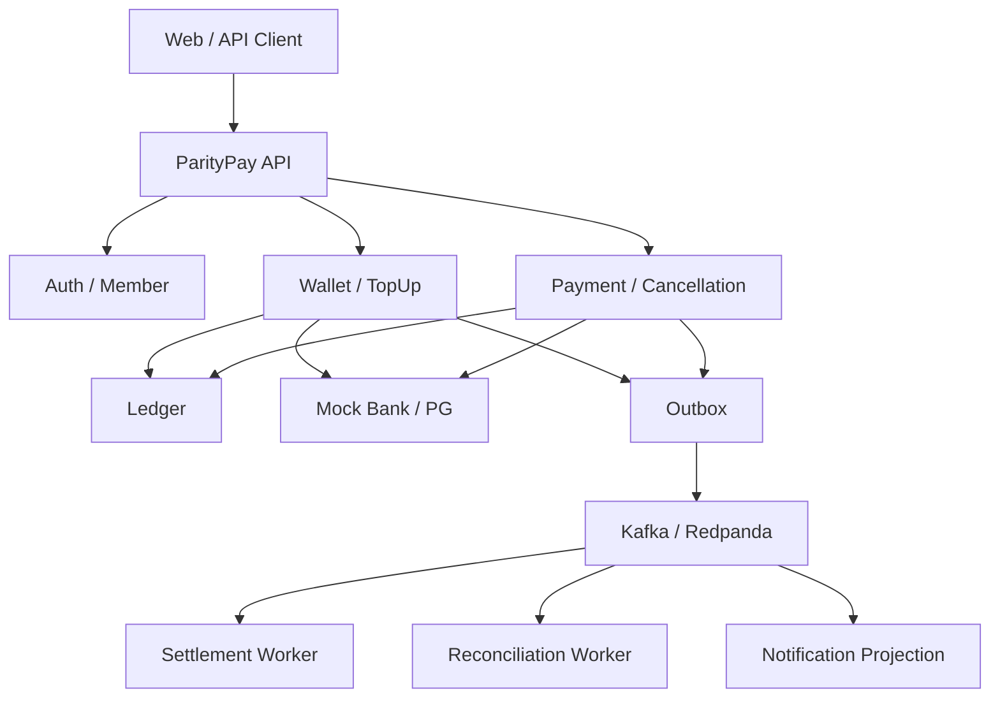

# ParityPay 기술 설계서 (DOC-05)

> **에이전트 지침**
> - **읽는 시점**: 새 클래스·패키지를 만들 때, 트랜잭션 경계를 정할 때, 의존성을 추가할 때.
> - **이 문서가 정하는 것**: 기술 스택, 모듈 구조와 허용 의존성, 계층 규칙, 트랜잭션 경계, 동시성 제어, 관측성.
> - **강제 규칙**: §5 의존성 표에 없는 모듈 간 참조를 만들지 않습니다. §6 계층 규칙을 위반하는 코드를 작성하지 않습니다. 스택 변경(§2)은 ADR 없이 하지 않습니다.

## 1. 설계 목표

ParityPay의 기술 구조는 금융 불변조건 보호, 실패 격리, 추적 가능성과 단계적 확장을 우선합니다. 초기에는 모듈러 모놀리스로 핵심 트랜잭션을 단순하게 유지하고, 외부 연동과 후속 업무만 명확한 포트와 이벤트 경계를 통해 분리합니다.

## 2. 기술 스택 기준안

| 영역 | 선택 | 목적 |
|---|---|---|
| Language | Java 21 | 장기지원 버전과 현대적 언어 기능 |
| Framework | Spring Boot 3.x | 트랜잭션, 보안, 관측성 생태계 |
| Persistence | Spring Data JPA + 선택적 jOOQ/JDBC | 도메인 쓰기와 복잡 조회 분리 |
| Database | PostgreSQL | ACID, 제약조건, 잠금과 운영 도구 |
| Migration | Flyway | 재현 가능한 스키마 버전 관리 |
| Broker | Kafka 또는 Redpanda | at-least-once 이벤트 전달 실험 |
| Cache | Redis | 속도 제한·TTL 캐시·임시 인증 데이터 |
| Test | JUnit 5, Testcontainers, jqwik | 단위·통합·속성 기반 테스트 |
| Observability | Micrometer, Prometheus, Grafana, OpenTelemetry | 메트릭·로그·트레이스 연결 |
| Load | k6 또는 Gatling | 재현 가능한 부하 시나리오 |
| Runtime | Docker Compose | 로컬 실행과 장애 실험 |

**Redis는 잔액이나 원장의 진실을 저장하지 않습니다.**

## 3. 논리 아키텍처



## 4. 모듈 구조

```text
parity-pay/
├── apps/
│   ├── pay-api/
│   ├── settlement-worker/
│   ├── reconciliation-worker/
│   ├── mock-bank/
│   └── mock-pg/
├── modules/
│   ├── member/
│   ├── wallet/
│   ├── payment/
│   ├── ledger/
│   ├── settlement/
│   ├── reconciliation/
│   ├── risk/
│   ├── operations/
│   └── shared-kernel/
├── deploy/
├── docs/
├── reports/
└── load-tests/
```

초기 MVP에서는 `pay-api` 안에 도메인 모듈을 함께 배포할 수 있습니다. 워커는 독립 프로세스 또는 동일 코드베이스의 별도 실행 프로필로 시작합니다.

## 5. 모듈 책임과 의존성

| 모듈 | 책임 | 허용 의존성 |
|---|---|---|
| member | 사용자, 인증 주체, 권한 | shared-kernel |
| wallet | 지갑, 충전·출금, 잔액 스냅샷 | member, ledger port |
| payment | 결제·취소 상태와 정책 | wallet port, ledger port, order port |
| ledger | 계정·거래·항목과 불변조건 | shared-kernel만 |
| settlement | 지급 대상·수수료·정산 | payment read port, ledger port |
| reconciliation | 내부·외부 기록 비교 | 각 모듈 read port |
| risk | 한도·빈도·위험 결정 | 읽기 포트만 |
| operations | 통합 타임라인·재처리·감사 | 각 모듈 operation port |

`ledger`는 다른 업무 모듈을 직접 참조하지 않고 `referenceType`과 `referenceId`만 저장합니다. 업무 모듈이 원장 포트를 호출합니다.

이 표는 ArchUnit 테스트로 강제합니다. 규칙을 어겨야 한다면 코드가 아니라 이 표를 먼저 고칩니다.

## 6. 계층과 패키지 규칙

각 모듈은 다음 계층을 사용합니다.

```text
domain/          순수 도메인 모델, 상태 전이, 정책
application/     유스케이스, 트랜잭션 경계, 포트
adapter/in/      REST, 이벤트 소비, 배치 진입점
adapter/out/     DB, 메시지, Mock 기관 클라이언트
```

- 도메인은 Spring과 JPA에 가능한 한 의존하지 않습니다.
- 애플리케이션 서비스가 트랜잭션 경계를 소유합니다.
- 컨트롤러는 인증·입력 변환 후 유스케이스를 호출합니다.
- 엔티티를 API 응답으로 직접 노출하지 않습니다.
- 모듈 간 쓰기 테이블 공유를 금지하고 공개 포트 또는 이벤트를 사용합니다.

## 7. 핵심 트랜잭션 경계

### 페이머니 결제 승인

하나의 PostgreSQL 트랜잭션에서 다음을 수행합니다.

1. 멱등성 레코드를 획득합니다.
2. 결제 Aggregate를 생성하거나 상태를 전이합니다.
3. 조건부 잔액 차감 또는 지갑 잠금을 수행합니다.
4. 균형 잡힌 원장 거래와 항목을 저장합니다.
5. 잔액 스냅샷을 갱신합니다.
6. `PaymentApproved` Outbox 행을 저장합니다.
7. 멱등성 응답을 저장하고 커밋합니다.

어느 단계든 실패하면 모두 롤백합니다. **이 트랜잭션 안에서 외부 네트워크를 호출하지 않습니다.**

### 외부 PG 승인

외부 호출과 DB를 하나의 트랜잭션으로 묶지 않습니다.

1. 내부 결제 시도를 `PROCESSING`으로 커밋합니다.
2. 외부기관에 비즈니스 멱등 키로 요청합니다.
3. 명시적 성공·실패는 새 로컬 트랜잭션에서 확정합니다.
4. 타임아웃은 `UNKNOWN`으로 전환하고 복구 작업을 예약합니다.

## 8. 동시성 제어

MVP 기본안은 지갑별 조건부 원자 업데이트입니다.

```sql
UPDATE wallet_balance
SET available_amount = available_amount - :amount,
    version = version + 1,
    updated_at = now()
WHERE wallet_id = :walletId
  AND available_amount >= :amount
  AND version = :expectedVersion;
```

갱신 행이 0개이면 버전 충돌과 잔액 부족을 최신 조회로 구분합니다. 제한된 횟수만 재시도합니다. 비관적 잠금과 비교 실험 후 [ADR-004](adr/004-atomic-balance-update.md)를 Accepted로 확정합니다.

## 9. 이벤트 전달

- 업무 변경과 Outbox 저장을 같은 DB 트랜잭션에서 처리합니다.
- 발행기는 `FOR UPDATE SKIP LOCKED`로 배치를 선점할 수 있습니다.
- 브로커 전달은 at-least-once로 가정합니다.
- 소비자는 `consumed_event`의 `eventId` 유니크 제약과 업무 유니크 제약으로 중복 효과를 막습니다.
- 파티션 키는 순서가 필요한 Aggregate ID를 사용합니다.
- 이벤트는 과거 사실을 나타내며 명령처럼 이름 짓지 않습니다 (`PaymentApproved` O, `ApprovePayment` X).

### 발행기가 여러 대일 때의 순서

파티션 키를 Aggregate ID로 두면 브로커 쪽 순서는 지켜집니다. 그러나 **발행기가 여러 대면 브로커에
넣는 순서 자체가 흔들립니다.** 같은 결제의 승인과 취소가 서로 다른 발행기의 배치로 나뉘고, 어느
쪽이 먼저 닿을지는 경쟁으로 정해지기 때문입니다. 실측에서 발행기 4대가 20,000건을 비울 때 50건이
역전됐습니다(reports/11 M-001).

순서가 뒤집히면 정산 금액이 달라집니다. 정산 소비자는 취소를 받았을 때 그 결제의 판매 항목이 이미
있는지로 처리를 가르므로, 취소가 구매확정보다 먼저 도착하면 취소를 "확정 전 취소"로 오해하고
버립니다(`SettlementOrderDependencyTest`: 10,000원 결제에 4,000원 취소일 때 판매자에게 3,600원이 더
나갑니다).

그래서 선점 쿼리는 **파티션 키마다 가장 앞선 미발행 이벤트 하나만** 집어갑니다. 앞선 형제가 아직
`PENDING`이면 그 형제를 잡은 발행기가 커밋하지 않았다는 뜻이고, 커밋은 브로커 ACK 뒤에 일어나므로
뒤 이벤트가 후보가 되는 시점에는 앞 이벤트가 이미 브로커에 들어가 있습니다. 발행기가 몇 대든 한
Aggregate 안의 순서가 유지됩니다.

대가는 head-of-line 대기입니다. 한 이벤트가 계속 실패하면 같은 Aggregate의 뒤 이벤트도 함께
멈춥니다. 순서를 지키려면 그래야 하고, 멈춘 사실은 적체 지표로 드러납니다. `FAILED`로 넘어간
이벤트는 더 이상 선두로 취급되지 않으므로 뒤 이벤트가 나갑니다 — 그 뒤에 재처리하면 순서가 뒤집힌
채 도착하며, 운영자 API가 그 사실을 응답에 알려 줍니다.

## 10. 외부기관 어댑터

Mock Bank와 Mock PG는 다음 기능을 제공합니다. 장애 테스트가 이 기능에 의존하므로 함께 구현합니다.

- 정상 성공과 명시적 실패
- 처리 전 타임아웃과 처리 후 타임아웃
- 응답 지연
- 중복 웹훅과 순서가 뒤바뀐 웹훅
- 상태 조회 API 일시 장애
- 취소·지급 성공 후 응답 유실
- 내부 요청과 다른 금액의 외부 기록

외부 요청마다 내부 ID, 외부 멱등 키, 요청 시각, 응답 코드, 마스킹된 요약과 마지막 조회 결과를 기록합니다.

**현재 구현 상태**

Mock Bank는 `apps/mock-bank`로 분리된 **별도 프로세스**이고, pay-api는 HTTP로 호출합니다
(`MockBankClient`). 분리 전에는 같은 프로세스의 빈이었고, 그때 "타임아웃"은 우리가 던지는 예외였습니다.
지금은 기관이 실제로 응답을 붙잡고 있고 클라이언트가 실제 읽기 타임아웃을 겪습니다. 그래서 다음이
재현됩니다.

| 재현되는 것 | 방법 |
|---|---|
| 응답 지연·읽기 타임아웃 | 기관이 `HANG_*` 모드로 응답을 붙잡습니다 |
| 처리 후 응답 유실(F-006·F-010) | 기관이 처리하고 응답만 끊습니다 |
| 연결 거부 | 기관 프로세스를 죽입니다(`docker compose stop mock-bank`) |
| 조회 API만 장애 | 조회에 503을 응답합니다(F-009) |

응답을 받지 못한 모든 경우는 `BankUnknownResultException` 하나로 모입니다. 연결 거부든 타임아웃이든
5xx든 남는 사실은 하나 — **자금이 움직였는지 모른다** — 이고, 그것을 실패로 바꾸면 시스템이 거짓말을
시작합니다(ADR-007).

읽기 타임아웃(`paritypay.mock-bank.read-timeout`, 기본 3초)이 곧 "미확정으로 넘어가는 시간"입니다.
길게 잡으면 그동안 스레드와 커넥션이 묶이고, 짧게 잡으면 정상 응답도 미확정이 됩니다. 복구가 있으므로
짧게 두는 편이 안전합니다.

**아직 남은 결합**: 기관이 pay-api와 같은 데이터베이스를 씁니다. 스키마는 pay-api의 Flyway가 만들고,
대사(`JdbcReconciliationSourceAdapter`)와 타임라인은 기관의 표를 직접 읽습니다. 실제 기관이라면 파일이나
API로 받아야 합니다. 이번 분리의 목적은 **호출 경계**를 진짜 네트워크로 만드는 것이었고, 데이터 경계는
남겨 두었습니다.

**Mock PG**도 `apps/mock-pg`로 분리했습니다. 위 표가 그대로 적용되며, 승인과 환불의 동작을 따로
제어합니다 — 승인은 되는데 환불만 막히는 상황은 실제로 흔하고 대응이 다릅니다(F-007).

은행과 **한 앱으로 합치지 않았습니다.** 다른 회사이고, 무엇보다 하나만 죽여야 의미 있는 실험이
됩니다. 카드 승인은 되는데 은행 출금이 안 되는 상황과 그 반대는 서로 다른 사고입니다.

## 11. 보안 설계

- 비밀번호와 결제 PIN을 Argon2id 또는 bcrypt로 해시합니다.
- 액세스 토큰과 리프레시 토큰의 수명과 철회 정책을 분리합니다.
- Mock 결제수단 토큰만 저장하고 인증정보 원문을 저장하지 않습니다.
- 고객·판매자·운영자 API를 역할과 리소스 소유권으로 보호합니다.
- 금액 변경 운영 작업은 필요 시 요청자·승인자를 분리합니다.
- 전체 계좌번호, 비밀번호, 토큰과 민감 개인정보를 로그에서 제외합니다.
- API 속도 제한, 로그인 실패 제한과 재생 공격 방지를 적용합니다.

### 비밀번호 변경·재설정

- 변경은 현재 비밀번호를 요구합니다. 현재 비밀번호 확인 실패는 로그인 실패와 같이 셉니다. 이
  경로를 세지 않으면 잠금을 우회해 비밀번호를 추측할 수 있습니다.
- 비밀번호가 바뀌면 그 사용자의 리프레시 토큰을 **모두** 철회하고 살아 있는 재설정 토큰도 죽입니다.
  바꾸는 이유 중 하나가 "누가 내 계정을 쓰고 있다"이므로 남은 세션이 살아 있으면 바꾼 의미가
  없습니다.
- 재설정 토큰은 원문을 저장하지 않고 SHA-256 해시만 남깁니다(리프레시 토큰과 같은 이유). 1회용,
  기본 수명 30분, 회원당 살아 있는 토큰은 하나입니다.
- 재설정 요청은 가입 여부와 무관하게 같은 응답(202)입니다. 다르게 답하면 가입 여부 조회 API가
  됩니다. 확인 실패도 사유를 구분하지 않습니다.
- 토큰은 전달 포트(`PasswordResetDelivery`)로만 나갑니다. 응답 본문에 실으면 이메일만 아는 사람이
  계정을 가져갈 수 있고, 로그에 남기면 로그 열람 권한이 계정 탈취 권한이 됩니다.
- **미완**: 이메일·SMS 전달 어댑터가 없습니다. 운영 기본 구현은 요청 사실만 남기고 토큰을 버리므로,
  전달 어댑터를 붙이기 전에는 재설정 흐름이 운영에서 완결되지 않습니다. 토큰 발급·1회성·만료·철회
  같은 기전은 모두 구현되어 있고 테스트로 검증합니다.

## 12. 관측성

### 로그 필드

`traceId`, `spanId`, `memberId`, `walletId`, `orderId`, `paymentId`, `ledgerTransactionId`, `idempotencyKeyHash`, `eventId`, `externalReferenceId`

멱등 키는 원문이 아니라 해시로 남깁니다.

### 메트릭

- 승인·충전·취소 성공률과 실패 사유
- `UNKNOWN` 건수와 체류시간
- 멱등 중복 차단과 키 충돌 건수
- 잔액 조건부 갱신 충돌률
- Outbox 미발행 수, 최고 지연과 재시도
- 소비 지연과 중복 차단
- 정산 실패·대사 불일치 건수·금액
- DB 잠금 대기, 커넥션 풀과 쿼리 지연

### 경보

원장 불균형과 음수 잔액은 한 건이라도 즉시 경보합니다. 성공률, 지연과 적체 임계치는 기준선 측정 후 확정합니다.

## 13. 배포와 환경

- `local`, `test`, `stage` 프로필을 분리합니다.
- Flyway가 애플리케이션보다 먼저 또는 시작 시 단일 주체로 실행됩니다.
- 롤링 배포 중 구·신 이벤트 소비자가 공존할 수 있도록 이벤트 호환성을 유지합니다.
- 스키마 변경은 expand-migrate-contract 순서를 따릅니다.
- 구성과 비밀값은 이미지 밖에서 주입합니다.
- 데이터 초기화는 로컬 전용 프로필에서만 허용합니다.

## 14. 확장 기준

다음 조건 중 하나가 **측정되면** 모듈 분리를 검토합니다. 측정 없이 분리하지 않습니다.

- 정산·대사의 배포 주기와 장애 영향이 API와 명확히 다릅니다.
- 원장 쓰기 처리량이 다른 업무보다 독립 확장이 필요합니다.
- 팀 소유권이 분리되고 계약 기반 개발 비용보다 이점이 큽니다.
- 단일 DB 잠금·커넥션 경합이 측정 가능한 병목입니다.

분리 시에도 원장 소유권과 업무 멱등 키를 유지하며 분산 트랜잭션을 가장하지 않습니다.
