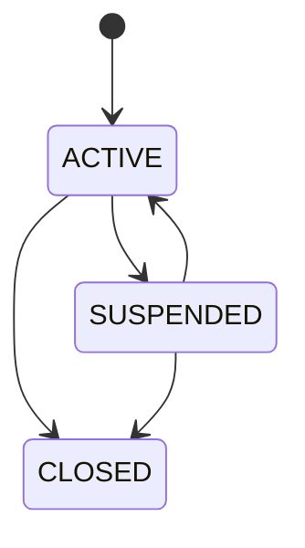
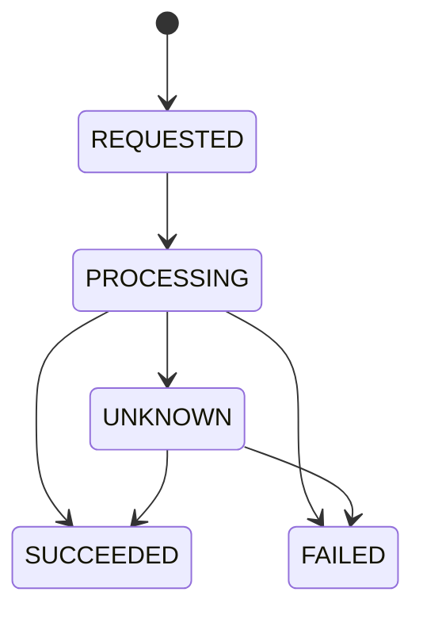
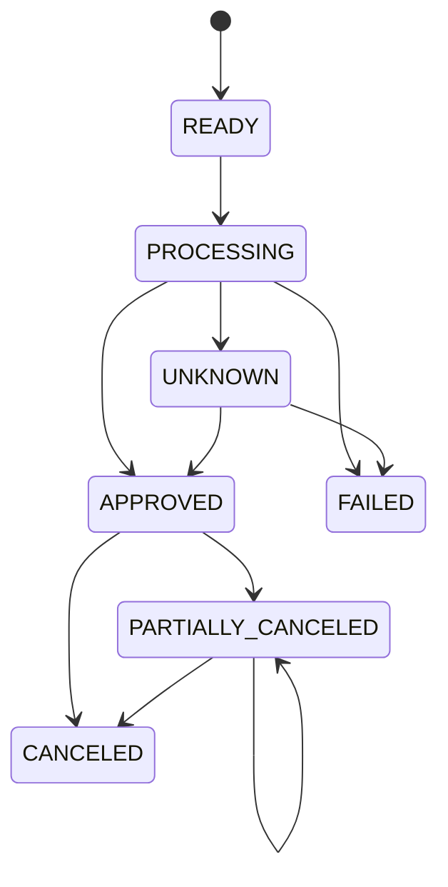
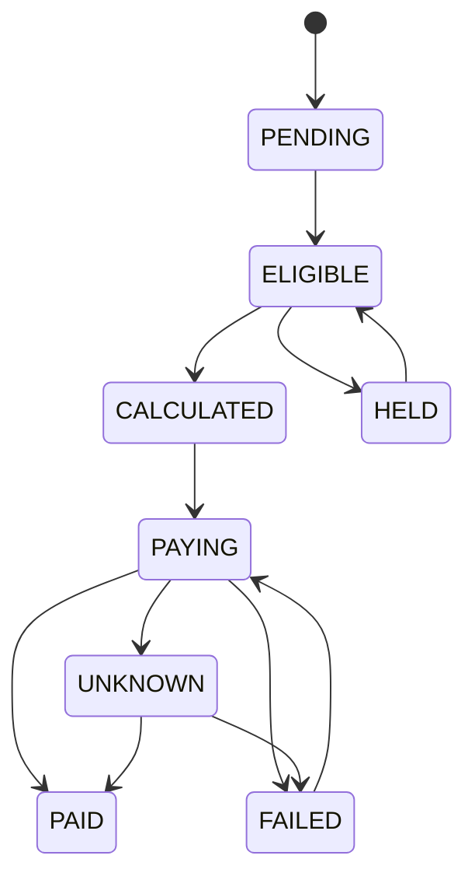

# ParityPay 도메인·상태 전이 설계서 (DOC-06)

> **에이전트 지침**
> - **읽는 시점**: Aggregate·엔티티·상태 enum을 만들거나 바꿀 때, 상태 전이 로직을 구현할 때.
> - **이 문서가 정하는 것**: Bounded Context, Aggregate 필드, 값 객체, 허용 상태 전이, 도메인 이벤트 발생 조건.
> - **강제 규칙**: §4·§5에 없는 상태 전이를 코드에서 허용하지 않습니다. 허용되지 않은 전이 요청은 `409 INVALID_STATE_TRANSITION`입니다. 새 상태를 추가하려면 이 문서를 먼저 고칩니다. 도메인 서비스(§8)는 I/O를 하지 않습니다.

## 1. Bounded Context

| Context | 핵심 언어 | 책임 |
|---|---|---|
| Wallet | 지갑, 가용잔액, 보류잔액, 충전, 출금 | 사용자 가치 저장과 이동 요청 |
| Payment | 결제, 승인, 취소, 환불 | 주문 대금의 결제 생명주기 |
| Ledger | 계정, 원장거래, 분개항목, 전기 | 모든 금융 효과 기록 |
| Settlement | 지급예정금, 수수료, 조정, 지급 | 판매자 정산 생명주기 |
| Reconciliation | 대사 실행, 불일치, 해결 | 내외부 기록 비교와 조치 |
| Risk | 한도, 규칙, 결정 | 거래 허용·추가인증·차단 |
| Operations | 타임라인, 작업, 감사 | 운영 조회와 통제된 복구 |

## 2. Aggregate 설계

### Wallet

```text
Wallet
- walletId
- memberId
- currency
- status
- createdAt
```

잔액은 높은 경합과 원장 재구축을 고려해 `WalletBalance` 투영으로 분리할 수 있습니다. Wallet은 상태와 소유권을 관리합니다.

### TopUp

```text
TopUp
- topUpId
- walletId
- bankAccountId
- requestedAmount
- completedAmount
- status
- externalReferenceId
- idempotencyKey
- requestedAt / completedAt
```

### Payment

```text
Payment
- paymentId
- orderId
- memberId
- walletId
- merchantId
- requestedAmount
- approvedAmount
- completedCancellationAmount
- processingCancellationAmount
- currency
- method
- status
- idempotencyKey
- approvedAt / createdAt / updatedAt
```

### PaymentCancellation

```text
PaymentCancellation
- cancellationId
- paymentId
- requestedAmount
- completedAmount
- reason
- status
- externalReferenceId
- idempotencyKey
- requestedAt / completedAt
```

### LedgerTransaction

```text
LedgerTransaction
- transactionId
- referenceType / referenceId
- transactionType
- currency
- status
- effectiveAt / createdAt
- entries[]
```

### Settlement

```text
Settlement
- settlementId
- merchantId
- periodStart / periodEnd
- grossAmount
- cancellationAmount
- feeAmount
- adjustmentAmount
- netAmount
- status
- items[]
```

## 3. 값 객체

원시 타입(`String`, `long`)을 그대로 쓰지 않고 아래 값 객체를 사용합니다.

- `Money(amount, currency)`: 음수 허용 여부는 사용 맥락이 아닌 타입별 생성자로 통제합니다.
- `IdempotencyKey(value)`: 길이·문자 제한과 민감정보 금지를 검증합니다.
- `OrderId`, `PaymentId`, `WalletId`: 문자열 혼용을 막는 타입입니다.
- `AccountNumberToken`: 원문 계좌번호 대신 안전한 참조를 나타냅니다.
- `JournalLine(accountId, direction, money)`: 양의 금액만 허용합니다.
- `CancellationCapacity`: 승인·완료·처리중 금액으로 취소 가능액을 계산합니다.

## 4. 상태 전이

여기 그려진 화살표만 허용합니다.

### Wallet



- `CLOSED`는 최종 상태입니다.
- 잔액 0, 처리 중 거래 없음과 운영 정책 충족 시에만 종료합니다.

### TopUp



- `SUCCEEDED`, `FAILED`는 최종 상태입니다.
- `UNKNOWN`은 실패가 아니라 외부 결과 확인이 필요한 상태입니다.

### Payment



- `FAILED`, `CANCELED`는 최종 상태입니다.
- `APPROVED`는 취소가 가능한 금융 확정 상태입니다.
- 부분 취소 실패는 Payment 상태를 바꾸지 않습니다.
- 결제 Aggregate는 취소 예약 시 `processingCancellationAmount`를 증가시켜 동시 초과 취소를 막습니다.

### PaymentCancellation


- `COMPLETED` 시 처리중 취소액을 감소시키고 완료 취소액을 증가시킵니다.
- `FAILED` 시 처리중 예약 금액을 해제합니다.

### Settlement



## 5. 상태 전이 명령표

| Aggregate | 명령 | 선행 상태 | 결과 상태 | 금융 효과 |
|---|---|---|---|---|
| TopUp | request | 없음 | REQUESTED | 없음 |
| TopUp | begin | REQUESTED | PROCESSING | 없음 |
| TopUp | succeed | PROCESSING/UNKNOWN | SUCCEEDED | 충전 분개 |
| Payment | request | 없음 | READY | 없음 |
| Payment | process | READY | PROCESSING | 잔액 예약 또는 없음 |
| Payment | approve | PROCESSING/UNKNOWN | APPROVED | 결제 분개 |
| Payment | fail | PROCESSING/UNKNOWN | FAILED | 예약 해제 |
| Cancellation | request | 없음 | REQUESTED | 취소 가능액 예약 |
| Cancellation | complete | PROCESSING/UNKNOWN | COMPLETED | 취소 분개 |
| Settlement | calculate | ELIGIBLE | CALCULATED | 지급 예정 집계 |
| Settlement | pay | CALCULATED/FAILED | PAYING | 없음 |
| Settlement | complete | PAYING/UNKNOWN | PAID | 정산 지급 분개 |

"금융 효과" 칸이 비어 있지 않은 명령은 반드시 원장 전기와 같은 트랜잭션에서 처리합니다.

## 6. 도메인 불변조건

- Payment 승인액은 0보다 크고 요청액을 초과하지 않습니다.
- Payment 완료·처리중 취소액 합계는 승인액을 초과하지 않습니다 (`INV-005`).
- 동일 Order에 허용된 성공 Payment 수는 정책상 하나입니다.
- LedgerTransaction의 POSTED 전환 전 차변·대변 합계가 같아야 합니다 (`INV-001`).
- POSTED LedgerTransaction과 Entry는 수정·삭제할 수 없습니다 (`INV-006`).
- Settlement 순액은 구성 항목 계산과 일치해야 합니다 (`INV-008`).
- SettlementItem의 동일 금융 부분은 한 번만 정산됩니다.

## 7. 도메인 이벤트 발생 조건

도메인 이벤트는 상태 변경이 DB에 커밋되는 트랜잭션에서 Outbox로 저장됩니다. 커밋 후 애플리케이션 코드에서 직접 발행하지 않습니다.

| 이벤트 | 발생 조건 |
|---|---|
| WalletCreated | Wallet ACTIVE 생성 완료 |
| TopUpCompleted | TopUp SUCCEEDED와 원장 전기 완료 |
| PaymentApproved | Payment APPROVED와 원장 전기 완료 |
| PaymentFailed | Payment FAILED 확정 |
| PaymentResultUnknown | Payment UNKNOWN 진입 |
| PaymentCancellationCompleted | Cancellation COMPLETED와 원장 전기 완료 |
| OrderConfirmed | 주문 구매확정 완료 |
| SettlementCreated | 정산 계산과 항목 고정 완료 |
| SettlementPaid | 지급·원장 전기 완료 |
| ReconciliationMismatchDetected | 대사 차이 신규 탐지 |

## 8. 도메인 서비스

- `PaymentAuthorizationService`: 주문·지갑·한도·위험 결과를 조합합니다.
- `CancellationPolicy`: 현재 상태와 금액에서 취소 가능액을 계산합니다.
- `JournalFactory`: 업무 사건을 균형 잡힌 분개로 변환합니다.
- `SettlementCalculator`: 결제·취소·수수료·조정으로 순액을 계산합니다.
- `ReconciliationMatcher`: 내외부 거래의 키·금액·상태를 비교합니다.

도메인 서비스는 I/O를 직접 수행하지 않으며 애플리케이션 서비스가 필요한 데이터를 준비합니다.
