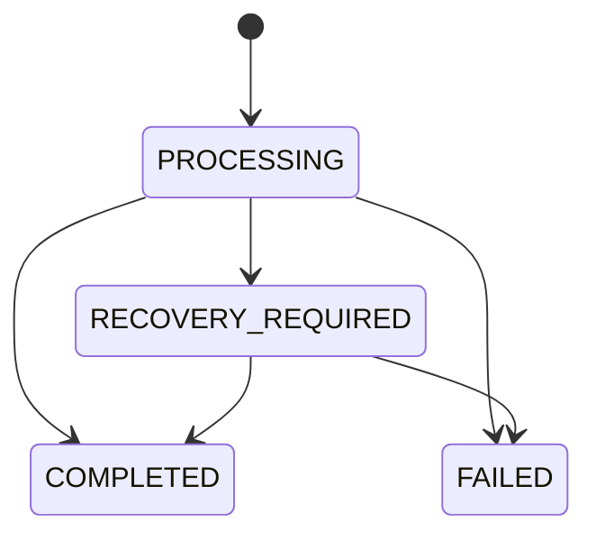
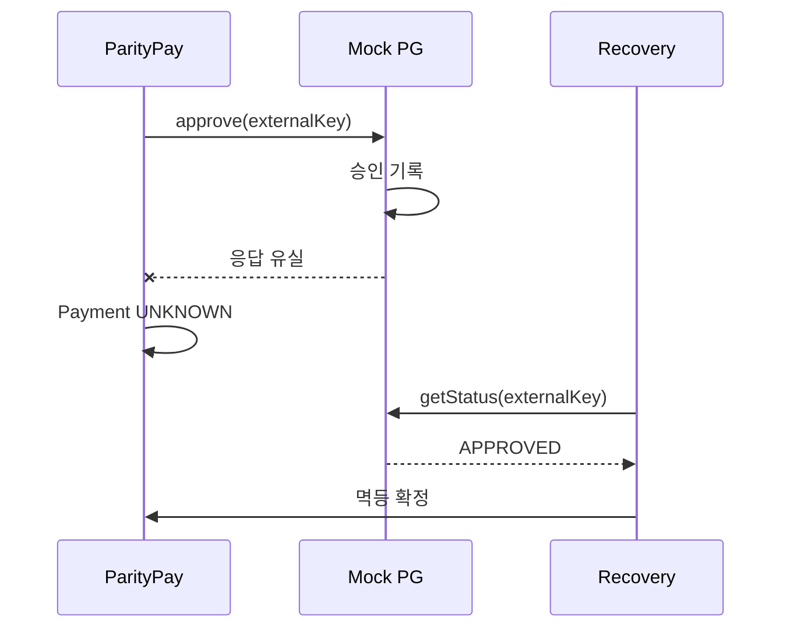

# ParityPay 거래 정합성 및 장애 복구 설계서 (DOC-09)

> **에이전트 지침**
> - **읽는 시점**: 멱등성, 동시성, Outbox, 이벤트 소비, 외부 호출, 복구 배치를 구현할 때.
> - **이 문서가 정하는 것**: 강한 일관성 구간, 멱등성 알고리즘, 잔액 동시성, Outbox와 소비자 규칙, `UNKNOWN` 복구, 재시도 정책.
> - **강제 규칙**: §13 "절대 금지 사항"은 예외 없이 적용됩니다. §2의 강한 일관성 구간은 반드시 하나의 로컬 트랜잭션으로 처리합니다. 외부 호출은 트랜잭션 밖에서 합니다.

## 1. 목적

이 문서는 네트워크, 프로세스, DB, 브로커와 외부기관이 독립적으로 실패할 수 있다는 전제에서 금융 효과의 중복·누락을 방지하고 불확실한 상태를 최종 상태로 수렴시키는 방법을 정의합니다.

## 2. 정합성 모델

### 강한 일관성이 필요한 구간

- 결제 상태 확정, 원장 전기, 잔액 스냅샷과 Outbox 저장
- 취소 가능액 예약과 Cancellation 생성
- 정산 헤더와 정산 항목 고정
- 소비 결과와 `consumed_event` 기록

이 구간은 하나의 PostgreSQL 로컬 트랜잭션으로 처리합니다.

### 최종적 일관성을 허용하는 구간

- Outbox에서 브로커로의 발행
- 주문·알림·조회 투영 갱신
- 외부기관 상태와 내부 `UNKNOWN`의 확정
- 정산 지급과 내부 상태 확정
- 일별 대사와 운영자 해결 상태

## 3. 멱등성 설계

### 요청 수명주기



### 알고리즘

1. 인증 주체, 작업과 키로 `idempotency_record` 삽입을 시도합니다.
2. 최초 요청이면 정규화된 본문 해시와 `PROCESSING`을 저장합니다.
3. 기존 레코드의 해시가 다르면 409를 반환합니다.
4. `COMPLETED` 또는 확정 `FAILED`이면 저장된 상태 코드와 응답을 재사용합니다.
5. `PROCESSING`이면 처리 중 응답 또는 제한된 대기를 사용합니다.
6. 금융 업무 레코드와 원장 유니크 제약을 두 번째 방어선으로 사용합니다.

응답 본문 저장 실패로 금융 거래를 롤백하지 않도록 응답 생성에 필요한 최소 업무 ID와 결과를 같은 트랜잭션에 저장합니다.

## 4. 잔액 동시성

### 위험 시나리오

잔액 50,000원에서 서로 다른 키의 40,000원 결제가 동시에 도착하면 두 요청이 모두 이전 잔액을 읽을 수 있습니다.

### 기본안

- `wallet_balance.version`과 충분 잔액 조건을 포함한 단일 UPDATE를 수행합니다.
- 갱신 1행이면 원장 전기와 결제를 같은 트랜잭션에서 완료합니다.
- 갱신 0행이면 최신 상태를 읽어 충돌과 잔액 부족을 구분합니다.
- 충돌 재시도에는 작은 무작위 지연과 횟수 제한을 둡니다.
- 인기 지갑의 경합률과 p99가 기준을 넘으면 지갑 단위 직렬화 등을 검토합니다.

### 교착상태 방지

- 여러 지갑을 잠그는 송금은 `walletId` 정렬 순서로 획득합니다.
- DB 교착상태 오류는 멱등성을 보존한 제한 재시도 대상입니다.
- 트랜잭션 안에서 외부 네트워크 호출을 하지 않습니다.

## 5. Transactional Outbox

### 원자성

업무 상태, 원장, 잔액 스냅샷과 Outbox를 하나의 트랜잭션에 기록합니다. DB 커밋이 성공하면 이벤트 발행 의도가 남고, 실패하면 모두 롤백됩니다.

### 발행기

- `PENDING`이면서 `next_attempt_at <= now()`인 이벤트를 선택합니다. 그중 **파티션 키마다 가장 앞선
  것 하나만** 후보가 됩니다. 앞선 형제가 아직 `PENDING`이면 뒤 이벤트는 빠집니다.
- 여러 발행기가 `FOR UPDATE SKIP LOCKED`로 나눠 처리합니다. 위 규칙 덕분에 발행기가 몇 대든 한
  Aggregate 안의 순서가 유지됩니다. 이 규칙이 없으면 같은 결제의 승인과 취소가 서로 다른 발행기의
  배치로 나뉘어 순서가 뒤집힙니다(reports/11 M-001에서 발행기 4대·20,000건에 역전 50건).
- 배치의 이벤트를 모두 보낸 뒤에 응답을 기다립니다. 한 건 보내고 기다리기를 반복하면 왕복 지연이
  그대로 처리량 상한이 됩니다(P-005: 56.9 → 143.7건/초).
- 브로커 ACK 이후 `PUBLISHED`로 표시합니다. 배치로 보내도 이 시점은 바뀌지 않습니다. 확인 전에
  표시하면 발행하지 않은 이벤트를 발행했다고 기록하게 됩니다.
- 발행된 것이 있으면 다음 폴링을 기다리지 않고 이어서 비웁니다(한 번에 최대
  `max-rounds-per-poll` 배치). **한 Aggregate의 발행 상한이 여기서 정해집니다** — 선두만 집어가므로
  그 Aggregate는 배치당 1건이고, 상한은 `max-rounds-per-poll ÷ poll-interval-ms`입니다. 기본값에서
  실측 26.6건/초이며, 두 값을 올리면 80건/초까지 갑니다(그 뒤로는 배치 왕복 비용이 상한).
  근거: reports/11 M-003. 그렇지 않으면 폴링 간격이 상한이 됩니다(배치 100 × 초당 2회 =
  200건/초). 배치마다 트랜잭션은 따로 끝납니다. "가득 찬 배치"가 아니라 "발행된 것이 있음"이
  조건입니다 — 파티션 키별 선두만 집어가므로 한 Aggregate에 적체가 몰리면 배치는 작지만 남은 일은
  많습니다.
- 부분 실패는 이벤트 단위로 처리합니다. 배치 하나가 일부 실패했다고 성공한 건까지 되돌리면
  중복 발행만 늘어납니다.
- ACK 유실로 재발행될 수 있으므로 소비자는 멱등해야 합니다.
- 지수 백오프, jitter와 최대 재시도 후 `FAILED`로 전환합니다.
- 운영자 재처리는 새 이벤트를 만들지 않고 같은 `eventId`의 발행을 다시 시도합니다.
  `GET /api/v1/admin/outbox-events`로 목록을 보고 `POST .../{eventId}/retry`로 `FAILED`를 `PENDING`으로
  되돌립니다. 되돌리는 것은 상태뿐이고 발행은 언제나 발행기가 합니다 — 확인 시점과 중복 규칙이 한
  곳에만 있어야 하기 때문입니다. 시도 횟수는 0으로 초기화합니다(그대로 두면 한 번 시도하고 곧바로
  다시 `FAILED`가 됩니다). 이전 횟수는 응답과 감사 로그에 남습니다.
- `FAILED`가 된 이벤트는 더 이상 파티션 키의 선두로 취급되지 않으므로 뒤 이벤트가 나갑니다. 그
  뒤에 재처리하면 순서가 뒤집힌 채 도착하고, 응답의 `laterSiblingPublished`가 그 사실을 알려 줍니다.
  막지는 않습니다 — 되돌리지 않으면 이벤트가 영영 나가지 않는 것이고, 어느 쪽이 나은지는 이벤트
  종류에 달렸습니다.

## 6. 소비자 멱등성

소비자 로컬 트랜잭션 안에서 다음을 처리합니다.

1. `(consumer_name, event_id)` 삽입을 시도합니다.
2. 이미 존재하면 성공 ACK하고 종료합니다.
3. 업무 결과를 유니크 비즈니스 키로 생성·변경합니다.
4. 소비 완료 상태를 기록하고 커밋합니다.
5. 커밋 후 브로커 ACK가 유실되어도 재전달은 2단계에서 종료됩니다.

부작용이 외부 호출이면 외부기관에 같은 비즈니스 키를 사용하고 로컬 intent·result 상태를 별도로 관리합니다.

## 7. 외부 승인 후 타임아웃



### 복구 규칙

- 타임아웃은 명시적 실패가 아닙니다.
- 동일 승인 요청을 무조건 재전송하지 않고 상태 조회를 우선합니다.
- 조회가 승인이라면 승인 원장이 이미 있는지 확인하고 없는 경우 한 번만 전기합니다.
- 조회가 실패라면 예약 자원을 해제하고 `FAILED`로 확정합니다.
- 조회 결과가 없음이면 기관별 안전 규칙에 따라 재요청 또는 보류합니다.
- 제한 시간 이후에도 불명확하면 자동 재시도를 중단하고 운영자·대사 대상으로 전환합니다.

## 8. 복구 작업 설계

| 작업 | 대상 | 주기 | 종료 조건 |
|---|---|---|---|
| UnknownPaymentResolver | 오래된 Payment UNKNOWN·PROCESSING (외부 PG) | 짧은 주기 | APPROVED/FAILED 또는 수동 검토 |
| UnknownCancellationResolver | Cancellation UNKNOWN·PROCESSING (외부 PG 환불) | 짧은 주기 | COMPLETED/FAILED 또는 수동 검토 |
| OutboxPublisher | PENDING/재시도 가능 Outbox | 연속 또는 짧은 폴링 | PUBLISHED/FAILED |
| StaleIdempotencyResolver | 오래된 PROCESSING | 중간 주기 | 업무 결과 기반 확정 |
| BalanceVerifier | 원장·스냅샷 차이 | 일별·수동 | 일치 또는 불일치 티켓 |
| ReconciliationJob | 내외부 거래 | 일별 | mismatch 생성·해결 |

모든 복구 작업은 리더 재선출, 중복 실행과 프로세스 종료를 견뎌야 합니다.

`UnknownPaymentResolver`는 `PaymentRecoveryService`로 구현되어 있고 충전 복구와 같은 규칙을
따릅니다. 대상은 **외부 PG 결제뿐**입니다. 페이머니 결제는 한 트랜잭션으로 끝나므로 미확정으로
남을 수 없고, 남았다면 그것은 복구가 아니라 조사할 문제입니다.

운영자 진입점:

```text
GET  /api/v1/admin/payments?status=UNKNOWN     미확정 결제 목록
POST /api/v1/admin/payments/{paymentId}/resolve  즉시 재조회 (사유 필수, 감사 로그)
```

재조회는 **조회만** 합니다. 외부에 승인을 다시 보내지 않으므로 이중 청구 위험이 없습니다.

환불도 같습니다(`CancellationRecoveryService`). 환불 재요청은 이중 환불이 되므로 조회로만
확정하고, 결과를 모르는 동안에는 예약한 취소 금액을 풀지 않습니다.

## 9. 장애 시나리오와 기대 결과

| ID | 장애 | 기대 결과 |
|---|---|---|
| F-001 | DB 커밋 전 프로세스 종료 | 업무·원장·Outbox 모두 없음 |
| F-002 | DB 커밋 후 응답 전 종료 | 재요청이 기존 결과를 반환 |
| F-003 | DB 커밋 후 발행 전 종료 | 재시작 발행기가 Outbox 발행 |
| F-004 | 브로커 ACK 유실 | 중복 발행되지만 소비 결과 1회 |
| F-005 | 소비 커밋 후 ACK 전 종료 | 재전달되지만 `consumed_event`로 차단 |
| F-006 | PG 승인 후 응답 유실 | UNKNOWN 후 APPROVED로 수렴 |
| F-007 | 취소 성공 후 응답 유실 | 상태 조회 후 중복 환불 없이 COMPLETED |
| F-008 | 웹훅 중복·역순 | 허용된 상태 전이와 버전으로 오래된 이벤트 무시 |
| F-009 | 정산 지급 후 응답 유실 | UNKNOWN 후 지급 조회·대사로 확정 |
| F-010 | 원장·스냅샷 차이 | 경보 후 원장 기반 재구축, 근거 보존 |

## 10. 대사와 보정

- 비교 키는 내부 업무 ID, 외부 참조 ID, 금액, 통화와 영업일입니다.
- 차이는 `INTERNAL_ONLY`, `EXTERNAL_ONLY`, `STATUS_MISMATCH`, `AMOUNT_MISMATCH`, `DUPLICATE`, `LEDGER_MISSING`으로 분류합니다.
- 지연 허용 시간을 넘은 차이만 운영 알림 대상으로 승격합니다.
- 보정은 기존 행 수정이 아니라 새로운 adjustment 업무와 원장 거래입니다.
- 금액 보정은 역할 분리와 이중 승인을 적용할 수 있습니다.

## 11. 재시도 정책

| 오류 | 재시도 | 방법 |
|---|---|---|
| 네트워크 연결·5xx | 가능 | 지수 백오프+jitter, 상한 |
| 429 | 가능 | Retry-After 존중 |
| DB deadlock·serialization | 제한적 가능 | 전체 로컬 트랜잭션 재실행 |
| 입력·권한·잔액 부족 | 불가 | 즉시 확정 실패 |
| 외부 타임아웃 | 동일 명령 반복 주의 | 상태 조회 우선 |
| 금액·통화 불일치 | 불가 | 수동 검토·대사 |

## 12. 데이터 복구 절차

운영 사고 시 이 순서를 따릅니다. 에이전트는 1~6단계까지의 조사·검증만 수행하고, 7단계 이후의 실제 보정은 사용자 승인 없이 실행하지 않습니다.

1. 쓰기 트래픽을 필요한 최소 범위로 제한합니다.
2. 영향 거래와 컷오프를 식별합니다.
3. 원장·업무·외부·이벤트 데이터를 읽기 전용으로 수집합니다.
4. 불변조건 쿼리로 범위를 검증합니다.
5. 자동 복구 가능 여부와 수동 보정 필요 여부를 분리합니다.
6. 보정안을 독립 검토하고 dry-run 결과를 남깁니다.
7. 보정 원장과 감사 로그를 생성합니다.
8. 대사와 고객·판매자 영향을 재검증합니다.
9. 원인·탐지·복구·재발방지를 사후 보고서에 기록합니다.

### 잔액 스냅샷 재구축 (F-010)

스냅샷과 원장이 어긋났을 때 고치는 것은 **스냅샷**입니다. 원장은 진실이므로 읽기만 합니다.

1. 지표 `paritypay.invariant.balance_snapshot_drift`가 **몇 개** 지갑에서 벌어졌는지 알려줍니다.
   **어느 지갑인지**는 `GET /api/v1/admin/wallets/balance-drift`가 차이 큰 순으로 돌려줍니다. 지갑
   하나를 자세히 볼 때는 `GET /api/v1/wallets/{walletId}/ledger-verification`을 씁니다(운영자 권한).
   이 지표는 주기적으로 계산해 캐시한 값이므로, 방금 고친 것이 반영되지 않았다면
   `paritypay.invariant.refresh_age_seconds`를 함께 봅니다.
2. **먼저 원인을 조사합니다.** 재구축은 증상을 지웁니다. 어떤 거래에서 벌어졌는지 타임라인 API로
   확인하기 전에는 실행하지 않습니다.
3. `POST /api/v1/admin/wallets/{walletId}/balance-rebuild`를 사유와 함께 호출합니다. 요청자와 다른
   `OPS_APPROVER`를 `X-Approver-Id`로 지정해야 합니다. 감사 로그에 전후 값이 남습니다.
4. 응답이 `REFUSED`이면 맞추지 않은 것입니다. 원장 잔액이 처리중 금액보다 작거나(진행 중 업무까지
   조사해야 합니다), 실행 도중 잔액이 바뀐 경우입니다. 후자는 재시도합니다.
5. 지표가 0으로 돌아오는지, 원장 거래·항목 수가 그대로인지 확인합니다.

재구축은 자동으로 돌지 않고, **한 번에 전부 맞추는 API도 없습니다.** 배경 작업이나 일괄 실행이
조용히 맞추면 원인을 조사할 증거가 사라지며, 그 판단은 어긋난 지갑이 많다고 해서 달라지지 않습니다.
목록 API는 찾아주기만 하고 고치지 않습니다.
실험 결과는 [reports/11](../reports/11-performance-failure-report-template.md) F-010에 있습니다.

## 13. 절대 금지 사항

- 타임아웃을 즉시 실패로 단정합니다.
- 확정 원장 행을 UPDATE 또는 DELETE합니다.
- 멱등성 없이 외부 승인·취소·지급을 자동 반복합니다.
- 운영자가 SQL로 잔액만 직접 수정합니다. (스냅샷 재구축은 §12의 절차와 승인을 거치며, 쓸 수 있는
  값은 원장 계산값 하나뿐입니다.)
- 메시지가 정확히 한 번 전달된다고 가정합니다.
- 원장 불균형을 조정 계정으로 영구 은폐합니다.
