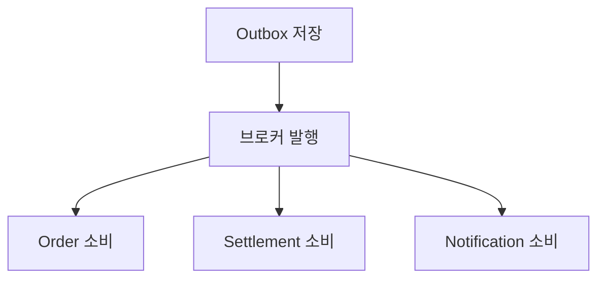
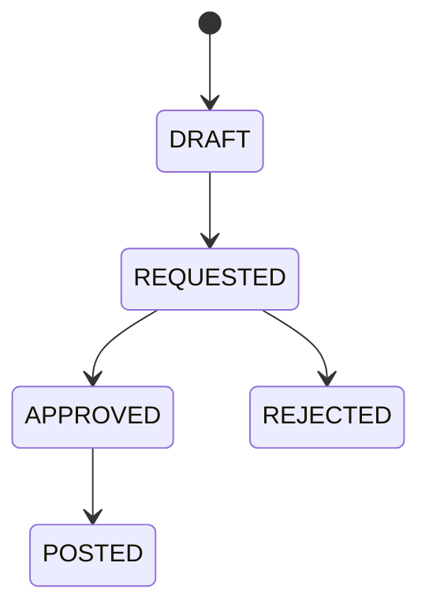

# ParityPay UI 화면 계획 (DOC-15)

> **에이전트 지침**
> - **읽는 시점**: 어떤 화면을 만들지, 그 화면에 무엇을 보여줄지 정할 때.
> - **이 문서가 정하는 것**: 화면 영역 구분, 화면별 표시 항목, UI 우선순위.
> - **이 문서가 정하지 않는 것**: 클라이언트가 지켜야 하는 계약과 프론트엔드 구조(DOC-14), 구현 순서와 백엔드 변경(DOC-16).
> - **주의**: 이 문서는 **하고 싶은 것**을 적은 것이고, 그중 일부는 아직 백엔드에 API가 없습니다. 무엇이 있고 무엇이 없는지는 [DOC-16 UI 구현 계획서](16-ui-implementation-plan.md)가 대조해 두었습니다. 이 문서만 보고 구현을 시작하지 않습니다.

ParityPay는 백엔드 중심 프로젝트이지만, 결제 흐름과 장애 복구 과정을 보여주려면 UI가 꽤 중요합니다. 다만 실제 간편결제 앱처럼 화면을 많이 만드는 것보다, 백엔드 설계의 강점을 시각적으로 증명하는 방향이 좋습니다.

## UI 영역 구성

ParityPay의 UI는 크게 다섯 영역으로 나눌 수 있습니다.

| 영역               | 사용자        | 목적                             | 중요도    |
| ------------------ | ------------- | -------------------------------- | --------- |
| 사용자 페이 화면   | 구매자        | 충전·결제·취소 경험 제공         | 필수      |
| 커머스 테스트 화면 | 구매자        | 상품 주문과 결제 흐름 시연       | 필수      |
| 판매자 정산 화면   | 판매자        | 지급예정액과 정산 근거 확인      | 확장      |
| 운영자 콘솔        | 운영자        | 장애 거래 조회·복구·대사         | 매우 중요 |
| 장애 시뮬레이터    | 개발자·면접관 | 실패 상황을 직접 발생시키고 관찰 | 매우 중요 |

포트폴리오 관점에서는 사용자 앱보다 **운영자 콘솔과 장애 시뮬레이터**가 더 강한 차별점이 됩니다.

# 1. 사용자 페이 화면

## 1.1 홈·지갑

사용자가 로그인한 뒤 가장 먼저 보는 화면입니다.

표시할 정보는 다음과 같습니다.

- 사용 가능 잔액
- 처리 중인 금액
- 연결된 계좌
- 이번 달 충전·결제 금액
- 최근 거래내역
- 충전 버튼
- 송금·출금 버튼
- 처리 결과 확인 중인 거래

```text
┌──────────────────────────────────────┐
│ ParityPay                   알림  MY │
├──────────────────────────────────────┤
│ 사용할 수 있는 금액                  │
│ ₩ 80,000                             │
│                                      │
│ 처리 중 ₩10,000                      │
│                                      │
│ [ 충전 ]  [ 송금 ]  [ 출금 ]         │
├──────────────────────────────────────┤
│ 최근 거래                            │
│ 상품 결제           -30,000   완료   │
│ 결제 부분 취소       +10,000   완료   │
│ 페이머니 충전       +100,000   완료   │
└──────────────────────────────────────┘
```

잔액만 보여주지 않고 `사용 가능 잔액`과 `처리 중 금액`을 구분하는 것이 중요합니다.

## 1.2 페이머니 충전

- 연결 계좌 선택
- 충전 금액 입력
- 충전 후 예상 잔액
- 일일·월간 한도 안내
- 결제 PIN 입력
- 충전 결과

빠른 금액 선택 버튼을 제공할 수 있습니다.

```text
[ +10,000 ] [ +30,000 ] [ +50,000 ] [ +100,000 ]
```

결과 화면은 다음 세 가지를 구분해야 합니다.

- 충전 완료
- 충전 실패
- 처리 결과 확인 중

특히 타임아웃을 실패로 표현하지 않고 다음과 같이 보여줘야 합니다.

> 금융기관에서 처리 결과를 확인하고 있습니다. 다시 충전하지 말고 잠시 후 거래 상태를 확인해 주세요.

## 1.3 거래내역

필터는 다음과 같이 구성합니다.

- 전체
- 충전
- 결제
- 취소·환불
- 송금
- 출금
- 처리 중
- 실패

각 거래에는 다음 정보를 표시합니다.

- 거래 유형
- 금액
- 발생 시각
- 상대방 또는 가맹점
- 현재 상태
- 거래 후 잔액

## 1.4 거래 상세

사용자에게는 기술적인 상태 대신 이해하기 쉬운 처리 단계를 제공합니다.


상세 정보는 다음과 같습니다.

- 결제 금액
- 취소 금액
- 최종 결제 금액
- 주문번호
- 가맹점
- 결제수단
- 승인 시각
- 취소 내역
- 거래 상태
- 문의용 거래번호

내부 원장 ID, 이벤트 ID와 멱등성 키는 일반 사용자에게 노출하지 않습니다.

## 1.5 결제창

실제 커머스 결제창과 유사하게 구성합니다.

- 주문 상품
- 상품 금액
- 할인 금액
- 최종 결제 금액
- 현재 페이머니 잔액
- 부족한 경우 충전
- 결제 PIN
- 결제 동의
- 결제 버튼

결제 버튼을 연속으로 눌러도 실제 결제가 한 번만 수행되는 모습을 데모할 수 있습니다.

## 1.6 취소·환불

- 전체 취소
- 부분 취소 금액
- 취소 사유
- 현재 취소 가능액
- 기존 취소 내역
- 환불 예상 결과

부분 취소 시 다음 계산을 보여주면 좋습니다.

```text
최초 결제액       30,000원
기존 취소액       10,000원
이번 취소액        5,000원
취소 후 결제액    15,000원
```

# 2. 테스트용 커머스 화면

ParityPay만 단독으로 만들면 결제의 전후 맥락이 부족합니다. 간단한 테스트 쇼핑몰을 함께 제공하는 것이 좋습니다.

## 필요한 화면

### 상품 목록

- 테스트 상품 5~10개
- 가격과 판매자
- 장바구니 담기
- 바로 구매

### 주문서

- 상품 목록
- 수량
- 총 주문금액
- ParityPay 결제 선택
- 주문 생성

### 주문 완료

- 주문번호
- 결제번호
- 결제 상태
- 구매확정
- 전체·부분 취소

### 주문내역

주문 상태와 결제 상태를 분리해 표시합니다.

| 주문 상태 | 결제 상태 |
| --------- | --------- |
| 배송 중   | 결제 승인 |
| 부분 반품 | 부분 취소 |
| 구매확정  | 결제 승인 |
| 주문 취소 | 전액 취소 |

이를 통해 `주문 상태 = 결제 상태`가 아니라는 설계를 자연스럽게 보여줄 수 있습니다.

# 3. 판매자 정산 화면

## 3.1 판매자 대시보드

- 총 결제금액
- 취소금액
- 수수료
- 지급 예정액
- 정산 완료액
- 정산 보류액
- 다음 정산일

## 3.2 정산 목록

| 정산 기간 | 결제    | 취소   | 수수료 | 조정 | 정산액  | 상태      |
| --------- | ------- | ------ | ------ | ---- | ------- | --------- |
| 9월 1~7일 | 500,000 | 50,000 | 13,500 | 0    | 436,500 | 지급 완료 |

## 3.3 정산 상세

정산금액이 어떻게 계산되었는지 주문 단위로 보여줍니다.

- 원결제
- 부분 취소
- 플랫폼 수수료
- 추가 조정
- 최종 지급액
- 지급 참조번호

## 3.4 정산 보류

- 보류 사유
- 대상 금액
- 분쟁 또는 위험 거래
- 보류 시작일
- 해제 상태

판매자 화면은 일반적인 매출 대시보드보다 **정산 금액의 근거를 추적할 수 있도록 만드는 것**이 핵심입니다.

# 4. 운영자 콘솔

ParityPay에서 가장 중요한 UI입니다.

## 4.1 운영 대시보드

첫 화면에는 시스템의 현재 건강 상태를 보여줍니다.

### 핵심 카드

- 오늘 결제 승인 금액
- 승인 성공률
- `UNKNOWN` 거래
- 원장 불균형
- Outbox 미발행
- 이벤트 소비 지연
- 정산 실패
- 대사 불일치 금액

색상 기준을 명확히 합니다.

- 정상: 초록색
- 확인 필요: 주황색
- 즉시 대응: 빨간색
- 상태 미확정: 보라색 또는 파란색

## 4.2 통합 거래 검색

다음 식별자 중 하나만 입력해도 관련 거래를 찾을 수 있어야 합니다.

- 주문번호
- 결제번호
- 취소번호
- 회원번호
- 지갑번호
- 원장 거래번호
- 외부기관 거래번호
- 이벤트 ID
- 멱등성 키 해시
- Trace ID

검색 결과에는 관련 기록을 하나의 타임라인으로 표시합니다.

```text
14:00:00.010  결제 요청 수신
14:00:00.021  멱등성 레코드 생성
14:00:00.035  잔액 차감
14:00:00.040  원장 거래 전기
14:00:00.044  Outbox 저장
14:00:00.051  DB 커밋
14:00:00.130  이벤트 발행
14:00:00.175  주문 상태 갱신
```

## 4.3 결제 상세

일반 사용자 화면보다 기술적인 정보를 제공합니다.

- 요청·승인·취소 금액
- 결제 상태와 상태 변경 이력
- 지갑 잔액 변경
- 멱등성 처리 결과
- 원장 거래
- Outbox 이벤트
- 외부 요청과 응답
- 재시도 횟수
- Trace ID
- 감사 로그

각 영역은 서로 연결되어야 합니다.

예를 들어 `ledgerTransactionId`를 누르면 해당 원장 상세로 이동하고, `eventId`를 누르면 이벤트 발행·소비 이력을 확인할 수 있도록 합니다.

## 4.4 원장 탐색기

백엔드 포트폴리오에서 특히 가치 있는 화면입니다.

### 원장 거래 상세

| 계정                 | 차변   | 대변   |
| -------------------- | ------ | ------ |
| 사용자 페이머니 부채 | 30,000 | 0      |
| 판매자 지급예정금    | 0      | 30,000 |
| 합계                 | 30,000 | 30,000 |

추가 정보는 다음과 같습니다.

- 원장 거래 유형
- 참조 업무 거래
- 통화
- 전기 시각
- 원거래 또는 역분개 연결
- 차변·대변 균형 여부
- 관련 이벤트

원장 행을 수정하는 버튼은 제공하지 않습니다.

## 4.5 `UNKNOWN` 거래 관리

- 미확정 거래 목록
- 현재 체류시간
- 외부기관
- 마지막 조회 결과
- 다음 자동 조회 시각
- 재시도 횟수
- 수동 검토 필요 여부

운영자가 사용할 수 있는 작업은 다음과 같습니다.

- 외부 상태 다시 조회
- 자동 복구 일시 중지
- 담당자 지정
- 대사 대상으로 전환
- 해결 메모 추가

성공·실패를 운영자가 근거 없이 직접 선택하는 기능은 두지 않는 것이 좋습니다.

## 4.6 Outbox·이벤트 모니터

- 이벤트 타입
- Aggregate ID
- 상태
- 발행 시도 횟수
- 최초 발생 시각
- 마지막 오류
- 다음 재시도 시각
- 소비자별 처리 상태

이벤트 하나를 선택하면 다음 흐름을 표시합니다.



운영자는 실패 이벤트만 재발행할 수 있고, 작업 사유를 입력해야 합니다.

## 4.7 대사 워크벤치

대사 불일치를 유형별로 보여줍니다.

| 유형          | 내부 | 외부 | 차이     | 상태      |
| ------------- | ---- | ---- | -------- | --------- |
| 상태 불일치   | 승인 | 실패 | 30,000원 | 검토 필요 |
| 외부에만 존재 | 없음 | 승인 | 50,000원 | 긴급      |
| 원장 누락     | 승인 | 승인 | 20,000원 | 미해결    |

상세 화면에는 다음 정보가 필요합니다.

- 내부 결제 기록
- 내부 원장
- 외부 거래 기록
- 금액과 상태 비교
- 가능한 원인
- 자동 해결 가능 여부
- 운영자 검토 기록
- 보정 분개 연결

## 4.8 보정 분개 요청

보정은 즉시 실행하지 않고 승인 흐름을 구성하는 것이 좋습니다.



입력 항목은 다음과 같습니다.

- 원거래
- 대사 불일치
- 보정 사유
- 차변 계정
- 대변 계정
- 금액
- 외부 증빙
- 요청자
- 승인자

# 5. 장애 시뮬레이터

ParityPay의 차별화 기능입니다. 면접관이 버튼을 눌러 장애를 만들고 복구 과정을 볼 수 있게 합니다.

## 5.1 시나리오 선택

- 정상 성공
- 명시적 승인 실패
- 승인 전 타임아웃
- 승인 후 타임아웃
- 응답 5초 지연
- 웹훅 중복 전달
- 웹훅 순서 역전
- 취소 성공 후 응답 유실
- 외부 상태 조회 장애
- 외부 거래금액 불일치
- Outbox 발행기 중단
- 이벤트 소비자 중단

## 5.2 실행 패널

```text
장애 시나리오
[ 승인 후 응답 유실 ▼ ]

대상 주문
[ ord_20260910_001 ]

응답 지연
[ 3,000 ms ]

중복 웹훅
[ 2회 ]

[ 시나리오 적용 ]  [ 결제 실행 ]
```

## 5.3 실시간 관찰 화면

한 화면에서 다음 정보를 동시에 보여줍니다.

- 클라이언트 응답
- 결제 상태 변화
- Mock PG 내부 상태
- 원장 생성 여부
- Outbox 상태
- 이벤트 소비 상태
- 복구 작업 실행
- 최종 결과

예를 들어 승인 후 응답 유실은 다음처럼 나타냅니다.

```text
PROCESSING
    ↓ Mock PG 승인
    ↓ HTTP 응답 유실
UNKNOWN
    ↓ 복구 작업 상태 조회
APPROVED
    ↓ 원장 전기 확인
RECOVERED
```

## 5.4 불변조건 모니터

항상 다음 조건을 표시합니다.

| 불변조건                  | 상태 |
| ------------------------- | ---- |
| 차변 합계 = 대변 합계     | 정상 |
| 가용 잔액 ≥ 0             | 정상 |
| 동일 요청 금융 효과 = 1회 | 정상 |
| 누적 취소액 ≤ 승인액      | 정상 |
| 원장 잔액 = 잔액 스냅샷   | 정상 |

장애가 발생해도 이 카드들이 계속 정상으로 유지되는 모습이 프로젝트의 핵심 데모가 됩니다.

# 6. 시스템 관측 대시보드

Grafana로만 제공해도 충분한 영역입니다.

## 대시보드 구성

### Payment Overview

- 결제 요청 수
- 승인 성공률
- 실패 사유
- p50·p95·p99
- `UNKNOWN` 진입·해소 건수

### Ledger Integrity

- 원장 거래 수
- 불균형 건수
- 잔액 스냅샷 불일치
- 보정 분개 건수

### Event Pipeline

- Outbox 적체량
- 가장 오래된 이벤트
- 발행 실패
- Consumer lag
- 중복 소비 차단

### External Dependency

- Mock PG 응답시간
- 타임아웃률
- 상태 조회 성공률
- Circuit Breaker 상태

# 추천 MVP UI

처음부터 모든 화면을 만들 필요는 없습니다. 1차 UI는 다음 7개면 충분합니다.

1. 테스트 상품·주문 화면
2. ParityPay 결제창
3. 지갑 홈·충전
4. 거래내역·상세
5. 운영자 통합 거래 검색
6. 원장 거래 상세
7. 장애 시뮬레이터

이 정도면 사용자 관점의 정상 결제와 개발·운영 관점의 장애 복구를 모두 시연할 수 있습니다.

## 2차 UI

- 부분 취소 화면
- 판매자 정산 대시보드
- `UNKNOWN` 거래 관리
- Outbox·이벤트 모니터
- 대사 워크벤치
- 보정 분개 승인
- 이상거래 관리

## 권장 메뉴 구조

```text
ParityPay
├── Shop
│   ├── Products
│   ├── Checkout
│   └── Orders
├── My Pay
│   ├── Wallet
│   ├── Top Up
│   └── Transactions
├── Merchant
│   ├── Sales
│   ├── Settlements
│   └── Holds
├── Operations
│   ├── Overview
│   ├── Transaction Explorer
│   ├── Unknown Transactions
│   ├── Ledger
│   ├── Events
│   ├── Reconciliation
│   └── Audit Logs
└── Lab
    ├── Failure Simulator
    ├── Scenario Runs
    └── Invariant Monitor
```

가장 추천하는 UI 방향은 일반 페이 앱을 화려하게 만드는 것이 아니라, **Shop + My Pay + Operations + Lab**의 네 영역을 연결하는 것입니다. 특히 사용자가 결제한 한 건이 운영자 화면의 원장, 이벤트, 외부기관 기록과 장애 시뮬레이터까지 연결되어 보이면 ParityPay의 백엔드 역량이 가장 효과적으로 드러납니다.