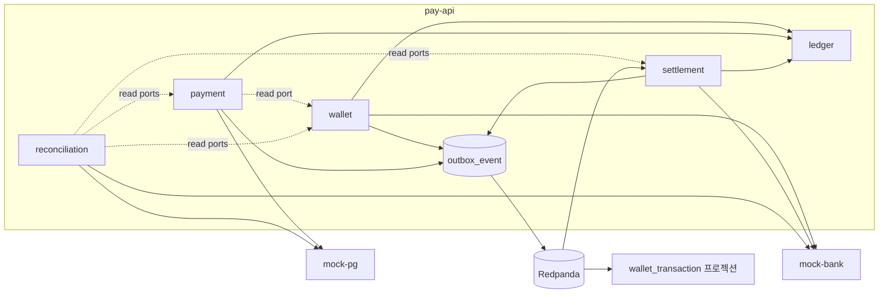
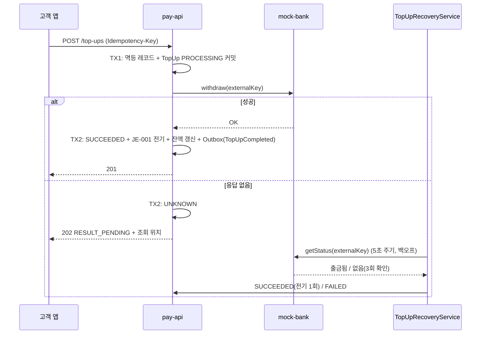

# ParityPay 기술 안내서 (DOC-18)

> **에이전트 지침**
> - **읽는 시점**: 저장소를 처음 볼 때, 어떤 모듈·흐름이 어디에 있는지 한 번에 훑고 싶을 때, 발표·인수인계 자료가 필요할 때.
> - **이 문서가 정하는 것**: 아무것도 정하지 않습니다. 이 문서는 **종합 안내서**이고, 정책·구조·계약의 기준은 각 절이 가리키는 문서입니다(DOC-00 §3 단일 진실의 원천). 여기 적힌 수치는 2026-09-14 기준 실측이며 근거 위치를 함께 적었습니다.
> - **강제 규칙**: 이 문서를 고쳐서 정책을 바꾸지 않습니다. 기준 문서를 고치고 이 문서는 따라갑니다. 측정하지 않은 수치를 적지 않습니다.

## 1. 한 페이지 요약

**무엇**: 플랫폼 내장형 페이머니 서비스. 충전·결제·취소·정산·대사를 이중부기 원장 위에서 처리하는
백엔드와, 고객 앱·운영 콘솔, 그 전부를 띄우는 배포 형태가 한 저장소에 있습니다.

**왜**: "정상 결제가 되는가"가 아니라 **"중복 요청, 동시 잔액 차감, 외부 승인 후 응답 유실, 이벤트
중복 전달, 프로세스 재시작 뒤에도 돈의 기록이 정확한가"**를 답하기 위해. 모든 구현 판단이 이 기준입니다.

**어떻게**: 원장을 시스템 오브 레코드로 두고(ADR-002·003), 금융 변경·원장·잔액 스냅샷·이벤트 발행
의도를 **한 로컬 트랜잭션**으로 묶고(ADR-005), 브로커의 at-least-once를 멱등 소비자로 흡수하며(ADR-006),
외부 결과를 모를 때는 `UNKNOWN`으로 보존하고 조회로만 확정합니다(ADR-007).

**상태 (2026-09-14)**: Phase 0~9 구현 완료. 백엔드 테스트 319 · 프론트엔드 56 · E2E 7, 실패 0. 부하·장애
실험 31종이 결함 13건(A~M)을 찾았고 전부 고쳤습니다. 근거: [reports/12](../reports/12-portfolio-technical-report-draft.md)

## 2. 저장소 지도

```text
parity-pay/
├── apps/
│   ├── pay-api/          조립 지점. Flyway 마이그레이션 20개, 인증, Outbox 발행기, 운영 API, 스케줄러
│   ├── mock-bank/        은행 대역 — 별도 프로세스, 자기 DB(paritypay_bank). 장애 모드 제어 API
│   ├── mock-pg/          카드 PG 대역 — 별도 프로세스, 자기 DB(paritypay_pg). 승인·환불·웹훅 모드 제어
│   ├── web-customer/     고객 앱 (React) — Shop · My Pay · 주문 · 거래내역 · 판매자 정산
│   ├── web-ops/          운영 콘솔 (React) — 거래 검색·타임라인 · 원장 · 미확정 · 대사·보정 · 장애 시뮬레이터
│   └── e2e/              Playwright — 목 없이 실제 스택을 도는 유일한 시험
├── modules/
│   ├── shared-kernel/    Money, 타입 ID, 오류 코드, 멱등성·이벤트 포트, 이벤트 JSON Schema (순수 자바)
│   ├── ledger/           이중부기 원장 — 도메인·전기·조회·JPA 어댑터. 다른 모듈을 모릅니다
│   ├── wallet/           지갑·잔액 스냅샷·충전·충전 복구·거래내역 프로젝션
│   ├── payment/          결제(페이머니·외부 PG)·취소·구매확정·복구
│   ├── settlement/       정산 계산·판매자 지급·지급 복구
│   └── reconciliation/   내부·외부 대사와 보정 분개
├── packages/
│   ├── api-client/       OpenAPI에서 생성한 타입 + fetch 래퍼 + 멱등 키·토큰·폴링 계약
│   └── ui/               두 앱이 공유하는 디자인 토큰·프리미티브 CSS
├── deploy/               배포 형태(nginx·TLS·compose), 관측 스택 설정, postgres 초기화
├── load-tests/           k6 스크립트, 장애·부하·다중 인스턴스 실험 파이썬, E2E 실행기
├── scripts/              dev.sh(로컬 스택), 문서 링크·불변조건 커버리지 검사
├── docs/                 DOC-00~18, ADR-001~013
└── reports/              11 성능·장애 보고서(실측), 12 포트폴리오 기술 보고서
```

Gradle 멀티모듈(백엔드)과 pnpm 워크스페이스(프론트엔드)는 분리되어 있습니다. `./gradlew build`가
프론트엔드 때문에 느려지지 않습니다.

## 3. 기술 스택

| 영역 | 선택 | 버전 | 비고 |
|---|---|---|---|
| 언어 | Java | 21 (toolchain) | Gradle 8.14.2, palantir-java-format(Spotless), Error Prone 2.50(위반은 오류) |
| 프레임워크 | Spring Boot | 4.1.1 | 3.5에서 판올림. 자동설정이 모듈로 쪼개져 스타터 없이 쓰면 명시 선언 필요(DOC-05 §10) |
| JSON | Jackson | 3 (`tools.jackson`) | Boot 4가 제공하는 `ObjectMapper`가 Jackson 3 |
| DB | PostgreSQL | 17 | 시스템 오브 레코드. `pg_stat_statements`·`track_io_timing` 켬 |
| 마이그레이션 | Flyway | Boot 관리 | V1~V20, 기관 DB는 각자 마이그레이션 |
| 브로커 | Redpanda | v24.3.6 | Kafka 호환. 토픽 하나 `paritypay.events` |
| 메일 | Mailpit | v1.21 | 비밀번호 재설정 SMTP. 밖으로 나가지 않는 진짜 왕복 |
| 테스트 | JUnit 5, Testcontainers 1.21.3, jqwik 1.10.1, ArchUnit 1.5.0 | | 인메모리 DB 없음 — 통합 시험은 실제 PostgreSQL·Redpanda |
| 관측 | Micrometer, OpenTelemetry(OTLP), Prometheus 3.1, Grafana 11.5, Jaeger 1.65 | | 불변조건 지표 `paritypay.invariant.*` |
| 부하 | k6 | | `load-tests/*.js` |
| 프론트 | TypeScript(strict), React 19.2, Vite 7.1, React Router 7, TanStack Query 5.90 | Node ≥ 20, pnpm 11.22 | |
| 프론트 테스트 | Vitest 3, Testing Library, MSW 2, Playwright 1.56 | | |
| 스타일 | 순수 CSS + `@paritypay/ui` 토큰 | | Tailwind 아님 ([ADR-012](adr/012-frontend-design-system.md)) |
| 실행 | Docker Compose | | 로컬 `docker-compose.yml`, 배포 `docker-compose.deploy.yml` |

기준 문서: [DOC-05 §2](05-technical-design.md). Redis는 compose에 있지만 **백엔드가 쓰지 않습니다.**

## 4. 아키텍처

### 4.1 모듈러 모놀리스

하나의 프로세스(`pay-api`)에 업무 모듈 다섯 개가 들어 있고, 모듈 사이는 **공개 포트 또는 이벤트로만**
통신합니다. 쓰기 테이블 공유 금지. ArchUnit이 강제합니다.



`ledger`는 다른 모듈을 참조하지 않고 `referenceType + referenceId`만 저장합니다. 업무 모듈이 원장
포트를 호출합니다. 왜 마이크로서비스가 아닌가: [ADR-001](adr/001-modular-monolith.md). 분리를 검토할
조건은 [DOC-05 §14](05-technical-design.md)에 있고, 2026-09-14 측정(M-013)에서 단일 DB는 아직 병목이
아니었습니다.

### 4.2 계층

```text
domain/        순수 도메인 모델·상태 전이·정책. Spring·JPA·Jackson 의존 금지(ArchUnit)
application/   유스케이스, 트랜잭션 경계(@Transactional은 여기에만), 포트 인터페이스
adapter/in/    REST 컨트롤러, Kafka 소비자, 스케줄 진입점
adapter/out/   JPA 저장소, Outbox, 기관 HTTP 클라이언트
```

### 4.3 외부기관은 별도 프로세스

`mock-bank`·`mock-pg`는 자기 데이터베이스를 가진 독립 프로세스입니다. 처음에는 같은 프로세스의 빈이었고
"타임아웃"은 우리가 던지는 예외였습니다. 분리한 뒤에야 실제 읽기 타임아웃, 처리 후 응답 유실, 프로세스
kill, 조회 API만 장애 같은 것이 **재현**됩니다. 대사도 기관 표를 조인하지 않고 명세 API로 받으며, 못
받으면 그 회차를 멈춥니다. → [DOC-05 §10](05-technical-design.md)

### 4.4 배포 형태

```text
브라우저 ─▶ app.<도메인> (nginx: 정적 파일 + /api 프록시) ─┐
브라우저 ─▶ ops.<도메인> (nginx: 정적 파일 + /api 프록시) ─┴─▶ pay-api (외부 비공개)
```

두 앱은 **다른 호스트이름**에 있고(쿠키는 포트를 구분하지 않으므로 포트만 달라서는 안 됨), 브라우저는
자기 오리진의 `/api`만 부르므로 **CORS 설정이 없습니다.** TLS 필수(`Secure` 쿠키). 비밀값은 이미지에
없고 없으면 뜨지 않습니다. → [ADR-011](adr/011-deployment-shape.md), `deploy/run.sh`

## 5. 핵심 흐름

각 흐름은 **트랜잭션 경계 · 분개 · 이벤트 · 실패 시 무엇이 남는가**를 적습니다.

### 5.1 충전 (은행 출금 → 페이머니)



- 외부 호출은 트랜잭션 **밖**입니다. 호출 전에 `PROCESSING`을 커밋해 두어야 프로세스가 죽어도
  "요청했는지"가 남습니다.
- 클라이언트는 202를 받으면 같은 키로 `GET /top-ups/{id}`를 폴링하고, "다시 충전" 버튼을 두지 않습니다(FE-002).
- 기준: [DOC-04 §3](04-payment-policy.md), [DOC-09 §7·§8](09-consistency-recovery.md), [ADR-007](adr/007-unknown-state.md)

### 5.2 페이머니 결제 (한 트랜잭션)

외부 호출이 없으므로 전부 **하나의 로컬 트랜잭션**입니다.

1. 멱등 레코드 획득 (`principalId + operation + key`)
2. Payment 생성/전이 (`READY → PROCESSING → APPROVED`)
3. JE-003 전기 (사용자 페이머니 Dr / 판매자 지급예정금 Cr)
4. Outbox `PaymentApproved`
5. 멱등 응답 저장
6. 잔액 조건부 차감 `UPDATE wallet_balance SET available = available - :a WHERE available >= :a AND version = :v` → 커밋

어느 단계든 실패하면 전부 롤백. 갱신 행이 0이면 최신 잔액을 다시 읽어 `INSUFFICIENT_BALANCE`와 버전
충돌을 구분합니다. 차감이 **마지막**인 이유: 행 잠금은 커밋까지 풀리지 않으므로 앞에 두면 뒤따르는
문장 전부가 잠금 안에서 실행됩니다(결함 I, 잠금 보유 17 ms → 4~7 ms). 잔액 부족이면 전체가 롤백되니
결과는 같습니다. → [DOC-05 §7·§8](05-technical-design.md), [ADR-004](adr/004-atomic-balance-update.md)

### 5.3 외부 PG 결제

충전과 같은 모양입니다: `PROCESSING` 커밋 → PG 승인 호출 → 결과를 새 트랜잭션에 확정 → 응답 없으면
`UNKNOWN` → `PaymentRecoveryService`가 조회로 확정. 분개는 JE-013(PG 미수금 Dr / 판매자 지급예정금 Cr)이고
**지갑 잔액은 건드리지 않습니다.** 환불(JE-014)은 카드로 돌아가며, 결과를 모르면 예약한 취소 금액을
풀지 않습니다. 웹훅이 먼저 도착할 수 있고(F-008) `webhook_receipt` 유니크 + 상태 전이 규칙으로 중복·역순을
흡수합니다.

### 5.4 취소 (예약 → 확정 2단계)

```text
요청 TX:  취소 가능액 = 승인액 − 완료 취소액 − 처리 중 취소액  검사
          processingCancellationAmount += 요청액   (예약)
          PaymentCancellation REQUESTED/PROCESSING 커밋
(외부 PG면 환불 호출 — 밖에서)
확정 TX:  COMPLETED: processing −= 요청액, completed += 요청액, JE-004 전기, Outbox
          FAILED:    processing −= 요청액 (예약 해제)
          UNKNOWN:   예약 유지 → CancellationRecoveryService
```

동시 부분 취소 6건 중 정확히 3건이 성공하는 시험이 `INV-005`를 지킵니다. 응답이 유실된 취소는 201이
아니라 **202**로 나가고 `GET .../cancellations/{id}`로 폴링합니다(결함 L). → [DOC-04 §6](04-payment-policy.md)

### 5.5 정산 (이벤트 소비 → 집계 → 지급)

```text
PaymentApproved / PaymentCancellationCompleted / OrderConfirmed  ──▶ settlement 소비자
      ↓ consumed_event(eventId) 유니크로 중복 차단, 파티션 순서로 승인→취소 순서 보장
settlement_item (SALE + / CANCELLATION − / FEE −)   ELIGIBLE는 구매확정된 것만
      ↓ 배치: 헤더 순액 = 항목 합 (INV-008), 수수료 = 만분율 정수 계산
Settlement CALCULATED → PAYING → 은행 지급 호출(밖) → PAID | FAILED | UNKNOWN
      ↓ JE-007(수수료), JE-008(지급)                UNKNOWN → SettlementRecoveryService: 조회만, 재지급 없음
SettlementPaid 이벤트
```

취소 이벤트가 승인보다 먼저 도착하면 정산이 틀립니다(10,000원 결제·4,000원 취소에서 3,600원 과지급).
그래서 발행기는 파티션 키마다 앞선 미발행 이벤트 하나만 집어 순서를 지킵니다(결함 F). → [DOC-05 §9](05-technical-design.md)

### 5.6 대사 (매일 04:00)

```text
ReconciliationJob ─▶ 기관 명세 API (트랜잭션 밖) ─▶ 못 받으면 ReconciliationSourceUnavailable: 회차 중단
                  ─▶ 비교·기록 (트랜잭션 안): 6종 불일치 → reconciliation_mismatch
                  ─▶ ReconciliationMismatchDetected 이벤트 → 운영 콘솔 대사 워크벤치
운영자: 보정 분개 요청(차변·대변 계정, 사유, 승인자 ≠ 요청자, 재인증) → JE-012 → 미해결 → 해결
```

`AMOUNT_MISMATCH`·`EXTERNAL_ONLY`는 자동 보정하지 않습니다. 지연 허용 30분, 창 7일. → [DOC-04 §9](04-payment-policy.md)

## 6. 신뢰성 메커니즘

이 프로젝트의 본체입니다. 각각 무엇을 막는지와 어디에 있는지를 적습니다.

| 메커니즘 | 막는 것 | 어디 | 기준 |
|---|---|---|---|
| 멱등 키 3겹 (헤더 → 업무 유니크 → 원장 유니크) | 같은 요청의 이중 효과 | `idempotency_record`, `payment.order_id` 유니크, `ledger_transaction(reference_type, reference_id, transaction_type)` | DOC-04 §5, DOC-09 §3 |
| 클라이언트 의도 키 | 재시도마다 새 키를 만드는 화면 | `packages/api-client` `intentStore`, `useSettlingWrite` | DOC-14 FE-001 |
| 조건부 잔액 갱신 | 동시 차감으로 음수 잔액 | `WalletBalanceRepository` | ADR-004 |
| 취소 금액 예약 | 동시 부분 취소 합이 승인액 초과 | `Payment.processingCancellationAmount` | INV-005 |
| Transactional Outbox | DB 커밋과 이벤트 발행 사이의 유실 | `outbox_event`, `OutboxPublisher` | ADR-005 |
| 파티션별 선두만 선점 | 발행기 다중화 시 Aggregate 순서 붕괴 | V18 `outbox_partition_order` | DOC-05 §9, 결함 F |
| 멱등 소비자 | at-least-once 중복 전달 | `consumed_event(event_id)` 유니크 | ADR-006 |
| DLT + 실패 표 + 경보 | 처리할 수 없는 레코드가 조용히 사라지는 것 | `DeadLetterRecoverer`, `dead_letter_event`, `paritypay.events.dlt`, `/admin/dead-letters` | DOC-09 §6, 결함 M |
| `UNKNOWN` + 조회 전용 복구 | 타임아웃을 실패로 오판한 재시도 → 이중 출금·이중 환불·이중 지급 | `*RecoveryService` ×4, `*_recovery` 테이블, 5초 주기·지수 백오프·리스·8회·"없음" 3회 확인 | ADR-007, DOC-09 §7·§8 |
| 웹훅 서명·허용 오차·영수증 | 위조·재전송·역순 웹훅 | `webhook_receipt`, `PARITYPAY_WEBHOOK_SECRET` | DOC-09 F-008 |
| POSTED 불변 (트리거) | 원장 원문 수정 | V3 `ledger_invariants` | INV-006, ADR-009 |
| 잔액 스냅샷 재구축 | 스냅샷·원장 불일치 | `POST /admin/wallets/{id}/balance-rebuild`, `GET /wallets/{id}/ledger-verification` | INV-010, ADR-008 |
| 불변조건 지표 | 위반을 못 보는 것 | `paritypay.invariant.*` 게이지(30초 캐시), Prometheus 규칙 | DOC-05 §12 |
| 리프레시 토큰 단일 비행·회전 | 탭 여러 개의 동시 재발급으로 세션 끊김 | `createTokenManager`, `refresh_token` 해시 1회용 | ADR-010, FE-008 |

**절대 금지**(CLAUDE.md §3)는 위 표의 뒷면입니다: 타임아웃을 실패로 단정하지 않음, 확정 원장 UPDATE·DELETE
금지, 멱등성 없는 외부 재시도 금지, 잔액 SQL 직접 수정 금지, 정확히 한 번 전달 가정 금지, 조정 계정
은폐 금지, 트랜잭션 안 외부 호출 금지, `float`/`double` 금지.

## 7. 데이터

### 7.1 마이그레이션 (apps/pay-api, V1~V20)

| 버전 | 내용 |
|---|---|
| V1 | `member`, `wallet`, `wallet_balance`, `bank_account` |
| V2·V3 | `ledger_account`·`ledger_transaction`·`ledger_entry`, 불변조건 트리거(POSTED 불변, 금액 > 0) |
| V4 | `top_up` |
| V5 | `idempotency_record` |
| V6 | 은행 대역 표 (→ V19에서 내보냄) |
| V7 | `payment`, `payment_cancellation` |
| V8 | `outbox_event`, `consumed_event`, `wallet_transaction` 프로젝션 |
| V9 | `top_up_recovery`, `audit_log` |
| V10 | `order_confirmation`, `settlement`, `settlement_item`, `settlement_recovery` |
| V11 | `reconciliation_run`, `reconciliation_mismatch` |
| V12 | `refresh_token`, `login_attempt` |
| V13 | `merchant` |
| V14 | `password_reset_token` |
| V15 | 외부 PG 결제 컬럼 |
| V16·V17 | `payment_recovery`, `cancellation_recovery`(PG 환불) |
| V18 | Outbox 파티션 순서 선점(결함 F) |
| V19 | 기관 표를 우리 DB에서 제거 — 기관은 자기 DB |
| V20 | `webhook_receipt`, `webhook_cursor` |

기관 DB(`paritypay_bank`, `paritypay_pg`)는 각 앱의 `db/mock-bank`, `db/mock-pg`가 관리합니다. 물리
스키마·인덱스 기준: [DOC-08 §2·§3](08-db-api-event-spec.md)

### 7.2 이벤트

토픽 하나(`paritypay.events`), 봉투(`eventId`·`eventType`·`eventVersion`·`aggregateId`·`partitionKey`·
`occurredAt`·`traceId`·`payload`), 이벤트마다 JSON Schema(`modules/shared-kernel/.../events/schema`).
`EventCatalogTest`가 표·스키마·상수를 맞춥니다. 구현된 이벤트: `WalletCreated`, `TopUpCompleted`,
`PaymentApproved`, `PaymentCancellationCompleted`, `OrderConfirmed`, `SettlementCreated`, `SettlementPaid`,
`ReconciliationMismatchDetected`. → [DOC-08 §6~§8](08-db-api-event-spec.md)

## 8. API

- 고객: `POST /members`, `/auth/tokens`, `/bank-accounts`, `/top-ups`, `/payments`, `/payments/{id}/cancellations`,
  `/payments/{id}/confirmation`, `GET /wallets/me`, `/wallets/{id}/transactions?cursor=`, `/payments?orderId=`
- 판매자: `GET /merchant/settlements`, `/merchant/settlements/{id}/items`
- 운영: `/admin/transactions/resolve?query=`(식별자 종류 판별), `/admin/transactions/{ref}/timeline`,
  `/admin/ledger/transactions/{id}`, `/admin/top-ups?status=UNKNOWN`·`/{id}/resolve`, `/admin/payments`(같음),
  `/admin/recovery/manual-review`, `/admin/outbox-events`·`/backlog`·`/{id}/retry`, `/admin/settlements`,
  `/admin/reconciliation/mismatches`·`/{id}/adjustments`(재인증 필요)·`/{id}/resolve`, `/admin/invariants`,
  `/admin/wallets/balance-drift`, `/admin/wallets/{id}/balance-rebuild`, `/admin/mock-bank/mode`, `/admin/mock-pg/mode`
- 인증: `/auth/tokens`, `/auth/tokens/refresh`(쿠키), `/auth/logout`, `/auth/reauth`, `/auth/password`,
  `/auth/password-reset`·`/confirm`. 웹훅: `/webhooks/mock-pg`(서명 검증, 토큰 없음)

모든 금융 쓰기는 `Idempotency-Key` 필수. 오류는 `{code, message, traceId}`이고 코드는 13개
(`INVALID_AMOUNT`, `INSUFFICIENT_BALANCE`, `IDEMPOTENCY_KEY_REUSED`, `INVALID_STATE_TRANSITION`,
`CANCELLATION_AMOUNT_EXCEEDED`, `RESULT_PENDING`(202), `LIMIT_EXCEEDED`, `RISK_BLOCKED`,
`EXTERNAL_TEMPORARY_ERROR`(503) 등). OpenAPI 스냅샷은 `docs/api/openapi.json`이고, 백엔드가 바뀌면
스냅샷 갱신 → `pnpm generate`로 프론트 타입을 다시 만들며 어긋나면 CI가 막습니다.
→ [DOC-08 §4·§5](08-db-api-event-spec.md), [DOC-04 §10](04-payment-policy.md)

## 9. 보안

| 항목 | 구현 |
|---|---|
| 인증 | 액세스 토큰(JWT, 메모리) + 리프레시 토큰(`HttpOnly`·`Secure`·`SameSite=Lax`·`Path=/api/v1/auth` 쿠키, 해시 저장, 1회용 회전). 동시 재발급 8건 → 1건 성공 |
| 역할 | `CUSTOMER`, `MERCHANT`, `OPS_VIEWER`·`OPS_OPERATOR`·`OPS_APPROVER`. 경로별 `hasRole` |
| 비밀번호 | 해시 저장, 로그인 실패 잠금(재인증·현재 비밀번호 확인 실패도 같이 셈), 변경 시 모든 세션 철회 |
| 재설정 | 토큰 SHA-256 해시만 저장, 30분·1회용, 가입 여부와 무관하게 202, SMTP로 커밋 뒤 전달 |
| 재인증 | 보정 분개 제출은 5분짜리 목적 클레임 토큰(`X-Reauth-Token`) 필요, 액세스 토큰으로 대체 불가 |
| 이중 승인 | 요청자 ≠ 승인자, 서버와 화면 둘 다 검사 |
| 웹훅 | 서명 비밀값 + 시각 허용 오차 5분 + 영수증 유니크 |
| 비밀값 | `PARITYPAY_JWT_SECRET`·`PARITYPAY_WEBHOOK_SECRET` 없으면 기동 실패. `local` 프로필에만 개발용 값 |
| 로그 | 계좌번호 전체·토큰·비밀번호 금지. 멱등 키는 해시 |

→ [DOC-05 §11](05-technical-design.md), [ADR-010](adr/010-refresh-token-cookie.md), [ADR-011](adr/011-deployment-shape.md)

## 10. 프론트엔드

두 앱(고객·운영)은 다른 오리진, 다른 성격입니다. 클라이언트가 지켜야 서버의 멱등성이 의미 있는 계약이
[DOC-14 §3](14-frontend-design.md)에 FE-001~014로 있습니다. 요점:

- **FE-001** 의도마다 멱등 키 하나, 브라우저 저장소에 보관, 끝날 때까지 재사용
- **FE-002** 202·`UNKNOWN`은 실패가 아님 — "확인 중" 표시, 재시도 버튼 없음, 폴링
- **FE-003** 제출 상태 기계 `idle → submitting → confirming → pending → settled | rejected`(`useSettlingWrite`)
- **FE-004** 거래내역은 프로젝션이라 늦음 — 방금 만든 거래는 "반영 중"으로 먼저 보여 줌
- **FE-005** 잔액은 스냅샷 — 기준 시각 표시, 클라이언트 계산 금지
- **FE-006** 취소 가능액은 경합 — 초과는 오류가 아니라 최신 값 재표시
- **FE-008** 토큰 회전 단일 비행, **FE-010** 이중 승인, **FE-014** 재인증

TanStack Query의 기본 재시도(쿼리 3회)를 끄고 명시적으로 통제합니다. 스타일은 `packages/ui` 토큰 +
순수 CSS이며 상태 색은 DOC-15 4.1절(정상 초록·확인 주황·즉시 빨강·미확정 보라)입니다 → [ADR-012](adr/012-frontend-design-system.md).
화면 목록: [DOC-15](15-ui-screen-plan.md), 구현 순서와 백엔드 격차: [DOC-16](16-ui-implementation-plan.md).

## 11. 관측성

- **로그**: `traceId`·`spanId`·`memberId`·`walletId`·`orderId`·`paymentId`·`ledgerTransactionId`·`idempotencyKeyHash`·`eventId`
- **지표**: 승인·충전·취소 성공률, `UNKNOWN` 건수·체류, 멱등 중복 차단, 잔액 갱신 충돌률, Outbox 미발행·지연,
  소비 지연, 정산 실패·대사 불일치, **불변조건 게이지** `paritypay.invariant.unbalanced_ledger_transactions`
  (INV-001)·`negative_wallet_balances`(INV-003)·`over_cancelled_payments`(INV-005)·`balance_snapshot_drift`
  (INV-010), 30초 캐시(결함 G 이후), `refresh_age_seconds`로 캐시가 멈춘 것을 드러냄
- **경보**: 불변조건은 임계치 없이 0이 아니면 즉시(`deploy/observability/rules/invariants.yml`)
- **트레이스**: OTLP → Jaeger. 로컬은 `scripts/dev.sh --observability`
- **DB**: `pg_stat_statements`·`pg_stat_activity` 10ms 샘플링을 실험 하니스가 읽음(M-007·M-013)

→ [DOC-05 §12](05-technical-design.md), 대시보드 4종: [DOC-15 6장](15-ui-screen-plan.md)

## 12. 테스트와 품질 게이트

| 층 | 무엇 | 수 (2026-09-14) |
|---|---|---|
| 백엔드 단위·통합·속성·아키텍처 | JUnit 5 + Testcontainers(PostgreSQL·Redpanda 실물) + jqwik + ArchUnit | 319 |
| 프론트 단위 | Vitest + Testing Library + MSW (API 목) | 56 |
| E2E | Playwright, 목 없음, 실제 스택 전부 | 7 (주간·수동) |
| 부하·장애 실험 | k6 + 파이썬 하니스, 결과는 reports/11 | 27종 |

원칙: 커버리지보다 **금융 분기·상태 전이 전수 검증**. 속성 테스트는 seed를 출력하고 반례는 회귀 테스트로
승격. 실패 테스트를 `@Disabled`로 덮지 않음. `FROM-CACHE`는 실행이 아님 — `--rerun-tasks --no-build-cache`.
CI 게이트: 빌드·테스트·Spotless·Error Prone·OpenAPI 스냅샷·생성 타입 일치·문서 링크·불변조건 커버리지
(`scripts/check-invariant-coverage.py`). → [DOC-10](10-test-strategy.md)

대표 시험: 동일 키 100회 → 효과 1회 / 동시 20~30건 → 1건 생성 / 잔액 50,000에 40,000 두 건 → 1건 승인 /
동시 부분 취소 6건 → 3건 성공 / Outbox 발행기 재시작 이어서 발행 / 중복 전달 → 거래내역 1줄 /
승인 후 타임아웃 → `UNKNOWN → SUCCEEDED` 금액 1회 / 지급 응답 유실 → `UNKNOWN → PAID` 지급 1회.

## 13. 실험이 찾은 결함 A~L

전부 실제로 띄우고 부하를 주고 죽이고 브라우저로 열어 봐야 나왔습니다. 설계 검토로 나온 것은 없습니다.

| 결함 | 무엇이 틀렸나 | 찾은 실험 |
|---|---|---|
| A | 마스킹된 계좌번호가 컬럼 길이를 넘침 | 부하 P-001 |
| B | Outbox 발행기가 운영 경로에서 전혀 돌지 않음(시험 경로만 동작) | 부하 P-005 |
| C | 브로커 장애 시 발행 라운드 전체가 롤백 — 성공한 발행도 되돌아감 | 크래시 F-003 |
| D | 정산 항목을 한 건씩 UPDATE | 크래시·부하 |
| E | 원장 계정 최초 생성이 경합에서 중복 | 부하 |
| F | 발행기가 여러 대면 Aggregate 안 순서가 깨짐 → 정산 과지급 | 다중 인스턴스 M-001 |
| G | 불변조건 지표가 스크레이프마다 원장 전체를 집계 | M-006 |
| H | 스케줄 작업 여섯 개가 스레드 하나를 나눠 씀 | M-006 |
| I | 잔액 차감이 트랜잭션 앞에 있어 행 잠금을 오래 쥠 | M-007 잠금 대기 분석 |
| J | 주문번호로 검색하면 타임라인에서 원장이 빠짐 | E2E 첫 실행 |
| K | 복구 작업이 틱당 한 배치라 초당 10건 상한 — 적체 600건부터 90초 안에 못 답함 | M-012 |
| L | 미확정 취소가 201로 나가고 취소를 조회할 API가 없음 | M-012 준비 중 |
| M | 소비자가 처리할 수 없는 레코드를 10회 즉시 재시도 뒤 DLT·지표 없이 버림 | M-018 poison message |

B·C·F·J·K·L 여섯은 "대비되어 있다"고 문서에 적혀 있던 것이었습니다. → [reports/11](../reports/11-performance-failure-report-template.md), [reports/12 §9·§12](../reports/12-portfolio-technical-report-draft.md)

## 14. 개발 환경과 명령

```bash
export JAVA_HOME=$(/usr/libexec/java_home -v 21)
scripts/dev.sh                       # 로컬 스택 전부 (컨테이너·기관·pay-api·앱 둘). 잡힌 포트는 우회 (ADR-013)
scripts/dev.sh down                  # 내리기 — 다른 세션이 같은 컨테이너를 쓰면 먼저 확인
./gradlew test                       # 백엔드 전체 (Testcontainers가 DB·브로커를 띄움)
./gradlew spotlessApply              # 커밋 전 포맷
pnpm -r test && pnpm typecheck       # 프론트엔드
UPDATE_OPENAPI_SNAPSHOT=1 ./gradlew :apps:pay-api:test --tests "*OpenApiSnapshotTest*" && pnpm generate
load-tests/run-e2e.sh                # 실제 스택 E2E (약 1분)
deploy/run.sh                        # 배포 형태 (nginx·TLS·이미지 빌드). down으로 정리
```

`main`에서 바로 작업하고, 커밋 전 `./gradlew test` 통과가 유일한 방어선입니다. 푸시·PR은 사용자 요청
시에만. → [CLAUDE.md §7~§9](../CLAUDE.md)

## 15. 문서 체계

정책은 한 문서만 소유합니다(DOC-00 §3). 무엇을 할 때 무엇을 읽는지는 [CLAUDE.md §4](../CLAUDE.md)의
표가 기준이고, 아래는 읽는 순서 제안입니다.

1. 용어가 낯설면 → [DOC-17 도메인 용어](17-domain-glossary.md)
2. 이 문서(DOC-18)로 전체 그림
3. 왜 이렇게 했는지 → [ADR 001~013](adr/README.md)
4. 만들기 전에 → DOC-04(정책) · DOC-06(상태) · DOC-07(분개) · DOC-08(계약) · DOC-09(복구)
5. 무엇이 실제로 측정됐는지 → reports/11 · reports/12

## 16. 알려진 한계와 미측정

- 송금·출금(JE-005·006), 위험 규칙(`risk`), 포인트(`2040`)는 정의만 있고 구현 범위 밖입니다.
- `PaymentFailed`·`PaymentResultUnknown` 이벤트는 카탈로그에 있지만 생산자가 없습니다.
- 성능 수치는 노트북 한 대에서 부하 도구·앱·DB가 CPU를 나눠 쓴 결과라 **절대 한계가 아니라 모양**입니다(reports/11 §2).
- E2E는 PR 게이트가 아닙니다(주간·수동). 디자인 변경(ADR-012) 뒤 E2E는 아직 돌리지 않았습니다.
- 화면의 명도 대비(WCAG)는 측정하지 않았습니다.
- Prometheus 스크레이프 대상이 `host.docker.internal:8080`으로 고정되어 있어 `pay-api` 포트를 우회하면 지표가 끊깁니다(ADR-013).
- Redis는 compose에 떠 있지만 쓰는 곳이 없습니다.
